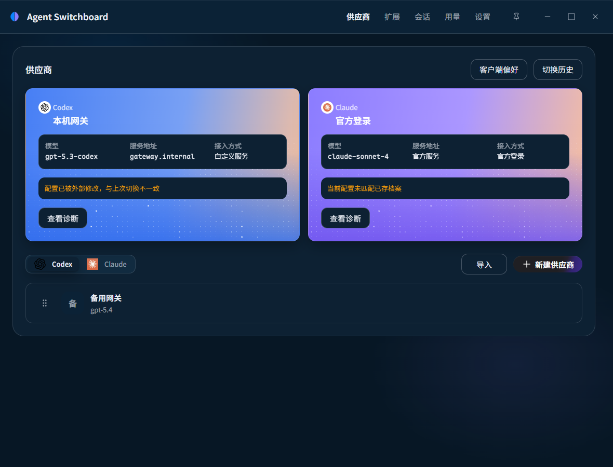
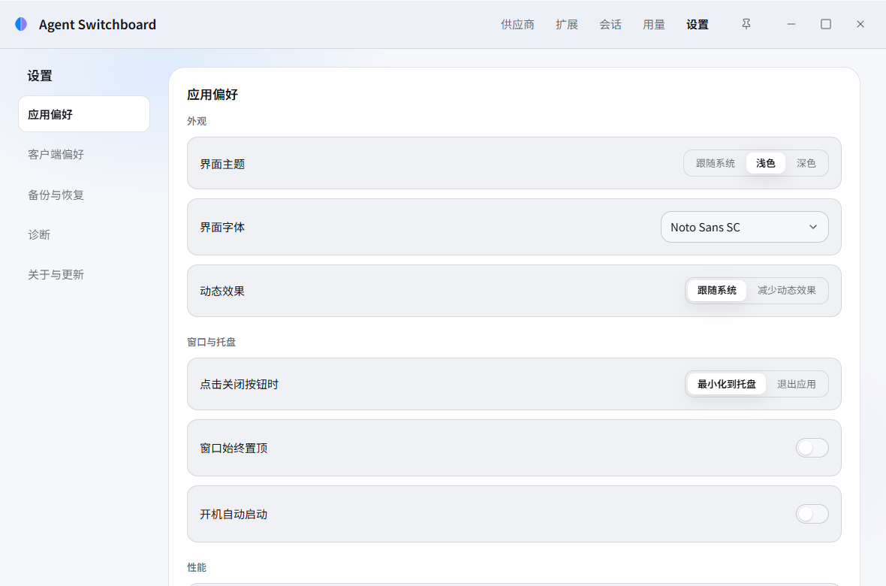

<p align="center">
  
</p>

<h1 align="center">Agent Switchboard</h1>

<p align="center">
  为 <strong>Codex</strong> 与 <strong>Claude Code</strong> 准备的本地配置控制台。<br>
  管理供应商档案、查看变更、确认切换；不必手改配置文件。
</p>

<p align="center">
  <a href="#界面">界面</a> · <a href="#核心能力">核心能力</a> · <a href="#开始使用">开始使用</a>
</p>

<p align="center">
  <a href="https://github.com/y4Nkk/agent-switchboard/actions/workflows/package.yml"></a>
  <a href="LICENSE"></a>
  
  
</p>

当你需要在多个供应商、模型或登录方式之间切换时，真正容易出错的往往不是选择本身，而是散落在客户端配置文件中的改动。Agent Switchboard 把这些改动收束为一条清晰的本地流程：保存档案，查看将要发生的变化，确认后再生效；需要回退时，直接从历史备份恢复。

它只服务 Codex 与 Claude Code。档案上游协议与客户端原生协议不一致时，它会启用仅监听 `127.0.0.1` 的本机转换网关；这不是公开服务、通用代理或自动故障转移。

## 界面

<p align="center">
  
</p>

<p align="center">
  
</p>

<p align="center">
  
</p>

截图来自实际生产前端与隔离测试夹具，档案和状态均为虚构，不包含真实用户数据。这些截图展示界面，不代表原生配置读写验收。

主导航为供应商、扩展、会话、用量、设置，默认进入供应商。发现与导入位于供应商子界面，官方额度和公开重置信号位于「用量 → 额度与重置」；备份、配置诊断、网关、日志和更新归入设置。编辑草稿跨工作区保留。

## 核心能力

### 把配置变成可管理的档案

- Codex 第三方档案使用独立的完整契约：服务 API 根、API 密钥、上游协议、请求模式、默认模型、客户端模型目录、模型映射和逐项能力必须同时保存；Claude Code 保持通用供应商档案。请求认证由 API 格式唯一推导：`Responses` 与 `Chat Completions` 使用 `Authorization: Bearer <API 密钥>`，`Anthropic Messages` 使用 `x-api-key: <API 密钥>`。两类档案都支持新建、编辑、排序、删除和从本机现有配置导入；Codex 转到 Anthropic Messages 时还必须给出正整数的最大输出 token 数。
- Claude Code 的自定义供应商与官方登录是两种清晰的连接方式。Codex 官方登录同样是一条可管理的连接方式：它可以像自定义供应商一样创建、重命名、删除和切回，只是不携带端点、密钥或模型目录。应用引导完成登录，但不会把登录令牌放进档案或界面中。
- 自定义供应商列表与编辑器共用「供应商测试」模块，内含连通性测试与真实请求：查看完整请求地址，临时填写测试模型或按需获取该连接的模型列表后从下拉选择，显式发送固定短提示并查看实际回复、状态码和耗时。失败时区分网络、TLS、路径、认证、参数、模型和上游错误，并展示脱敏后的响应正文、request id 与 endpoint；正文超过 16 KiB 时明确标注截断。列表测试已保存档案，编辑器测试当前未保存的连接；草稿密钥只在准备时进入后端，模型获取、发送与取消只携带内存中的 `requestId`；请求凭证仅驻留内存，支持取消；每次请求可能产生少量费用，不修改客户端配置。原有连通性测试仅检测地址可达，真实请求只在收到有效模型回复后判定成功。
- Codex 的 provider 标识和本应用对应显示统一为 `openai`：官方订阅直连，所有第三方模型请求经本机网关。先完成文件存储模式的官方登录才能激活第三方（目前不支持 keyring、auto、ephemeral），切换和恢复只写配置，不改 `auth.json`。Claude Code 的 Anthropic Messages 保持原生直连，其他协议通过网关。
- Codex 跨协议及最小请求路由会在候选配置中把 `web_search` 固定为 `disabled`，但不会改写该供应商保存的网页搜索偏好；回到标准 `Responses` 后原值恢复。`client_metadata`、`prompt_cache_key`、`reasoning.summary=auto` 与 `reasoning.encrypted_content` 不会转发到非 Responses 上游，变更预览会明确提示这一限制。`reasoning.effort` 例外：它按目标协议方言转换——Chat Completions 用档案声明的思考方言，Anthropic Messages 用 `output_config.effort`，显式 `none` 用 `thinking.type = "disabled"`，没有对应档位时明确失败而不是猜测。
- 新建与编辑页分组展示资料、连接与模型，按需展开高级选项；服务地址下直接显示后端解析的请求 URL，保存和取消位于统一底栏。
- 每个供应商独立保存运行参数。在供应商编辑页点击「配置运行参数」进入二级子界面，返回保留草稿，和连接信息一起保存；切换供应商同时应用它自己的参数。「自动」清除对应的手动值，由客户端与模型决定默认行为。
- 通知、历史、审批与沙箱等偏好集中在「设置 → 偏好设置」，官方设置目录按需展开；全局指令位于「扩展 → 全局指令」。Codex 的默认子 agent 模型与默认推理强度位于各供应商的「配置运行参数」：模型从该供应商的模型列表选择，推理强度用滑块设置，切换时一同投影，适用于通过本机 harness 接入的非 OpenAI 上游。偏好设置中的「子 agent 运行」只直管启用、最大并发和中断消息三个全局键；各处的「自动」都会移除自己拥有的键，角色表与其余用户配置保留。客户端偏好支持「保存并预览应用」，确认后才写入客户端配置。

### 在落盘之前看见改变

Codex 第三方服务地址必须是**包含 API 前缀的完整 API 根地址**。例如 `https://example.com/v1` 对应 `/v1/responses`，`https://example.com/openai/v2` 对应 `/openai/v2/responses`；Codex 不接受只填域名的档案。导入的裸 OpenAI 地址在扫描与后端补全中规范为 `/v1`；所有可导入行（Claude、Codex 第三方、Codex 官方登录）统一复选，由底部「导入所选」一键导入，Codex 行在后端自动补全成完整严格档案。Claude Code 保持自己的服务根规则，Anthropic 地址在根后追加 `/v1/messages`。完整请求 endpoint、URL 凭据、查询参数和片段不能作为服务地址保存。

Codex 档案显式保存 `requestMode`（`standard` / `minimal`）以及每个模型与操作的能力声明。Codex 到网关支持 HTTP/SSE 和 WebSocket；网关到第三方统一使用 HTTP/SSE，不提供 WebSocket 或保留登录开关。第三方配置仅写 `model_provider = "openai"` 与带稳定本机 capability 的 `openai_base_url`，第三方密钥留在应用档案中，官方 OAuth 不转发给第三方。

最小模式经网关省略 reasoning、service_tier、store、include 和 metadata 等可选字段，保留输入与工具语义；WebSocket 续聊先重建上下文再裁剪字段，未知 response ID 明确失败。原生 Responses 的 `/responses/compact` 与 V2 `compaction_trigger` 按档案能力直接处理；桥接路由只在明确需要时生成 ASB 摘要。仅 ASB 自有 `asb-compaction-v1.` 载荷可在同一路由重启后续接，跨后端不透明内容明确拒绝；已有会话文件不迁移、不改写。推理续接同理：`asb-reasoning-v3.` 载荷封存可读文本、上游签名与上游自己的不透明块，只回放给产生它的同一后端，本机密文从不进入上游请求，跨后端无法阅读的不透明内容明确拒绝。第三方请求需要本应用持续运行，退出后重新打开即可恢复有效路由；不会自动切回官方或更换供应商。

缺少显式 Responses 能力字段的旧档案会被拒绝，原文件保持不变；需要补齐字段或重新导入，不进行能力猜测或旧格式回退。

- 启用前先显示脱敏差异、候选配置和备份位置；没有确认，就不会修改客户端配置。
- 系统会识别外部编辑冲突和占用中的写入锁，让你先处理不确定状态再继续。
- 不属于供应商参数或客户端偏好的字段保持原样，不会被一次切换覆盖。

### 让每一次切换可撤回

- 每次确认切换都会创建本地备份；可查看历史、恢复指定备份，或撤回上一次切换。
- 可选择把应用自己的配置备份到你控制的 Supabase 项目；云端内容在离开设备前加密，快照包含每个供应商的独立运行参数、API 格式、最大输出 token 和客户端偏好，不包含原始客户端配置文件；认证请求头始终由保存的 API 格式推导。恢复直接前一版（schema 3）快照时，应用会把共享参数一次性分配到各供应商，再按当前 schema 4 重新加密回写云端；更早或不完整的快照明确拒绝。

### 扩展（Skills 与 MCP）有自己的工作区

- 「扩展」页以 Skills / MCP 页签、客户端启用数量、搜索和紧凑列表管理资源；视觉沿用本项目设计。Skill 来源发现独立成页，本机发现、新建、编辑和历史通过弹窗进入；支持全库检查更新、逐项或全部更新、按绑定固定内容版本，部署仍按客户端与作用域确认。供应商切换不会触碰已部署的扩展。
- 每次安装、停用、移除都先展示脱敏计划与目标文件清单，确认后经事务写入；多目标批次失败会整体回滚，中断的操作可从历史恢复。
- 敏感值只存入系统凭据存储，配置里只写环境变量引用或按预览明示写入的值；连接检测是显式发起的有界探测，结果只代表本次检测，不代表原生客户端已连通。扩展数据保存在本机，不参与云端备份。

### 网关端口长期稳定，失败可恢复

- 新安装默认监听 `http://127.0.0.1:47821`，Codex 与 Claude Code 共用这一个地址；端口只保存在本机网关状态里，重启、升级、切换供应商都不会改变它，已有安装保留自己的原端口。
- 在「网关」页可以直接修改端口：先校验并占用新端口，再预览每个客户端的完整服务地址变化，确认后在一笔可恢复事务中只更新网关端点与网关端口；上游地址、API 密钥、模型、运行参数、客户端偏好与本机能力令牌保持不变。关闭预览会立即释放端口，未确认的预览也会自动过期。修改完成后请重启相关客户端或会话。
- 端口被占用或绑定被系统拒绝时，应用照常打开并明确给出原因（含可识别的占用进程信息），提供「重试」与「修改端口」；不会自动换号，也不会让依赖网关的写入落在连不上的地址上。
- 状态损坏、丢失，或客户端中的网关身份无法与当前路由精确匹配时，进入「需要修复」，由你重新应用供应商；中断的端口修改按恢复记录回滚或完成，回滚目标被外部修改时保留现场等你决定。

### 了解本机使用状态

- 查看 Codex 官方订阅额度、重置时间及只基于真实读取结果的本地趋势。
- 汇总本机 Codex 与 Claude Code 会话中的模型 token，按时间和模型查看趋势与构成；这与供应商余额明确分开。
- 从系统托盘快速发起切换，或只读浏览本机会话并在新终端中恢复。

## 使用方式

1. 新建一个供应商档案，或从本机已有配置导入。
2. 在档案中选择 API 格式，填写模型与连接信息；点击标题旁的「配置运行参数」进入子界面调整此供应商的参数，返回后统一保存。
3. 选择目标档案并打开变更预览，确认差异无误后执行切换。
4. 如果结果不符合预期，从备份历史恢复，或撤回上一次切换。

## 本地、透明、可控

- 默认在本机运行：没有账号体系、遥测或通用请求代理；仅跨协议切换时使用受限的 `127.0.0.1` 转换网关。
- 密钥只在必要时写入客户端要求的位置；预览、差异、日志和错误信息都会使用脱敏标记。
- 真实配置文件只会在你确认切换、恢复或确认应用 Codex 子 agent 设置后变更；每条写入路径均在写入前备份、写入后验证。
- 应用不会注入客户端、修改安装包，也不会改写会话或 SQLite 数据。

## 开始使用

### 安装包

macOS、Linux 与 Windows 的直接安装包通过 [GitHub Releases](https://github.com/y4Nkk/agent-switchboard/releases/latest) 提供。Windows 使用自绘安装引导（WPF 界面、内嵌静默 NSIS 部署引擎）及应用内签名更新；引导不依赖 WebView2，缺少运行环境时会从 Microsoft 下载并静默安装。

Windows 同时构建 Microsoft Store 专用 MSIX。该包只作为标签构建的 Actions 制品保留，供维护者提交 Partner Center；在 Store 认证并重签名之前，它不会作为 GitHub Release 资产公开分发。Store 安装的版本由 Microsoft Store 自动更新，不会调用 GitHub 更新器。

### 从源码运行

准备好 [Tauri 的平台依赖](https://v2.tauri.app/start/prerequisites/)、Node.js 和 Rust 后，在仓库根目录执行：

```bash
npm ci
npm run dev:desktop
```

若只需开发前端界面，可运行 `npm run dev:frontend`。构建和测试脚本见 [`package.json`](package.json)。

在 Windows 上，`npm run tauri:build:windows` 通过系统 .NET Framework C# 编译器生成自绘安装包，输出至 `target/release/bundle/installer`；`npm run msix:build` 随后调用 Windows 10 SDK 的 `MakeAppx.exe` 生成独立 Store MSIX。MSIX 不包含自绘引导，由 Microsoft Store 安装和更新。MSIX 版本从 Cargo 版本映射为四段数字：`X.Y.Z` 对应 `X+1.Y.Z.0`；第四段保留为 `0`，避免与 Store 的版本规则冲突。

## 参与项目

欢迎通过 [Issues](https://github.com/y4Nkk/agent-switchboard/issues) 提交问题或建议。提交代码前请阅读 [AGENTS.md](AGENTS.md)，其中说明了配置写入、安全边界和验证要求。

## 社区

感谢 [LINUX DO](https://linux.do/) 社区的支持与交流。

## 项目文档

| 文档 | 内容 |
| --- | --- |
| [DESIGN.md](DESIGN.md) | `Frosted Relay` 的视觉与交互契约 |
| [progress.md](progress.md) | 当前阶段目标、验收与退出条件 |
| [CHANGELOG.md](CHANGELOG.md) | GitHub Release 与应用内更新说明 |
| [AGENTS.md](AGENTS.md) | 贡献规范、产品边界与安全规则 |

## 许可证

本仓库中由 Agent Switchboard 编写的源码与文档以 [MIT License](LICENSE) 发布。第三方依赖继续遵守各自的许可证；本许可证不授予任何第三方商标的使用权。

产品名称 `Codex`、`Claude Code` 及相关商标归其各自权利人所有；Agent Switchboard 与 OpenAI、Anthropic 均无隶属、认可或合作关系。
