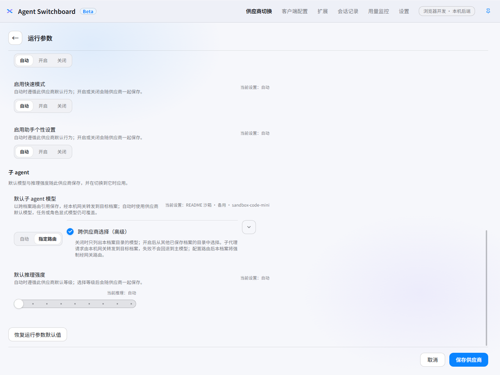

<p align="center">
  
</p>

<h1 align="center">Agent Switchboard</h1>

<p align="center">
  面向 <strong>Codex</strong> 与 <strong>Claude Code</strong> 的本地配置控制台。<br>
  用供应商档案、类型化预览与可恢复切换，替代直接手改客户端配置文件。
</p>

<p align="center"><sup><a href="README.md">English</a> · 简体中文</sup></p>

Agent Switchboard 将供应商档案、客户端配置、扩展管理和本机状态收束在同一桌面应用中。真实配置只有在明确确认后才会由唯一的切换执行器写入；每次可恢复写入均可观察、备份、校验和恢复。

## 当前界面（隔离演示数据）

<p align="center">
  
</p>

<p align="center"><sub>供应商工作区：当前源码实际渲染，展示已应用的「README 沙箱 · 主路由」以及两个可切换的虚构档案。</sub></p>

<p align="center">
  
</p>

<p align="center"><sub>客户端配置：在隔离客户端根目录中读取和编辑受控设置，保持真实界面的分组、状态与操作结构。</sub></p>

<p align="center">
  
</p>

<p align="center"><sub>切换预览：对「README 沙箱 · 备用」生成的真实类型化预览；只有点击确认后才会写入隔离沙箱。</sub></p>

<p align="center">
  
</p>

<p align="center"><sub>子 agent 模型路由：主路由档案把备用档案的模型指定为默认子 agent 模型；请求由本机网关转发，失败不回退主模型。</sub></p>

> **截图数据说明**：截图由当前源码启动的实际前端与同一 Tauri 本机后端生成。运行过程将 `APPDATA`、`LOCALAPPDATA`、`USERPROFILE`、`CODEX_HOME` 和 `CLAUDE_CONFIG_DIR` 全部重定向到隔离临时目录；档案名、模型、密钥占位、服务地址和配置内容均为虚构的 README 沙箱数据（仅使用 `*.sandbox.example` / `example.com`）。没有读取、写入或截图真实用户的 Codex / Claude Code 配置、凭据、账号、会话、服务地址或文件。

## 产品范围

- 仅管理 Codex 与 Claude Code。
- 所有配置、备份、历史和诊断都保留在本机。
- 第三方上游协议与客户端协议不一致时，应用只在 `127.0.0.1` 启动本地转换网关。
- 不提供云同步、遥测、账户体系、公开代理、自动代理或隐式提供商切换。

## 核心能力

### 供应商档案

- 建立、编辑、排序、导入和删除 Codex 与 Claude Code 供应商档案。
- 将全部供应商的完整配置导出为 SQL 文件，在其他设备的应用内选择该文件即可导入，无需命令行。
- 保存模型、认证、请求协议、请求模式、模型映射和运行参数。
- Codex 档案的默认子 agent 模型是跨档案路由引用：可指定任意已保存档案目录中的模型，请求由本机网关转发到该档案，携带路由的档案一律经网关激活。引用不可解析时在保存、切换与请求三个环节显式报错——绝不回退到主模型；被引用的档案在路由存在期间不可删除。
- 在写入前生成类型化预览；真实写入由可观察、可备份、可校验、可恢复的执行器完成。
- 保留不属于当前档案的客户端配置键，避免覆盖用户已有设置。

### 客户端配置

- 管理两端的通用配置、Codex 子 agent 运行设置和当前客户端的全局指令文件。
- 当前受控字段始终由界面状态归一化：显式值写入、自动值删除；已知历史字段会在同一可恢复事务中清理，未知字段保持原样。
- 配置草稿可读取脱敏后的本机真实配置；界面未拥有的字段可在受控手动编辑器中修改，敏感标记由后端保留原值，所有写入均须预览、确认、备份和校验。
- 配置格式错误时，应用只提供可证明安全的自动修复候选；无法确认语义的错误不会被静默覆盖。
- 全局指令直接编辑对应的用户级文件，与同一客户端的通用配置并列管理。

### 客户端工具

- 只保留 Codex 工作场景与 Claude 客户端集成两项没有其他页面归属的客户端专属功能。
- Codex 工作场景只保存并恢复已有供应商、扩展与指令的组合状态；它不创建第二套配置，也不重复管理这些资源。
- 不展示连接状态、跨页面快捷入口或供应商、通用配置、网关、用量、会话、诊断、MCP 与 Skills 的重复内容。

### 扩展

- 管理 Skills 与 MCP 服务，支持客户端启停、搜索、更新、导入、导出和本机发现。
- 列表主点击直接进入编辑；部署、诊断、项目安装、连接检测、能力审计和删除集中在独立高级管理面。
- 扩展写入默认即时执行；只有敏感连接数据、删除仍有安装的定义和 Claude 项目共享 Skill 停用需要额外确认。

### 本机协议网关

- Codex（Responses）在 Chat Completions 或 Anthropic Messages 上游间转换，Responses 上游直通；Claude（Anthropic Messages）在 Chat Completions、Responses 或 Gemini 上游间转换，Anthropic 上游直通。
- 无法无损表达的字段与工具在转发前报错，不做静默丢弃：例如 stop_sequences 到 Responses 上游、strict 工具与音频到 Anthropic 上游、web_search 等服务端工具到任意跨协议上游。仅影响计量或缓存的纯元数据（如 cache_control，以及 Gemini 上游的 metadata.user_id）在校验后丢弃。
- Codex 跨协议请求必须 store=false；previous_response_id 与短续接由本机工具历史回填为完整上下文，原生 Responses 上游仍使用上游自身存储。
- 推理轨迹以绑定路由的加密续接载荷往返；切换档案或密钥后旧续接会被拒绝。
- Codex 子代理模型路由按请求解析：携带 `asb:` 前缀的模型 id 匹配到被引用档案后，其端点变体整体替换候选列表（无跨供应商故障转移，失败即失败），前缀剥离后按目标档案自身目录准入与改写，用量归因到目标档案。辅助操作对此类 id 显式拒绝。被引用的模型同时以路由 id 合入客户端模型目录文件与 `/v1/models`。
- Codex 的 WebSocket 传输由网关终结，上游统一走 HTTP/SSE；Claude 故障转移只按本机 `claude-failover.json` 显式策略执行并配合熔断冷却，不做隐式切换。

### 状态、恢复与诊断

- 提供当前连接、用量、额度、会话、备份、日志、配置状态和网关诊断。
- 用量页提供「降智雷达」：以内置或自定义题目在本机批量调用 Codex CLI 实测当前激活配置，展示每次通过结果、reasoning tokens 与真实消耗；检测会话计入用量统计，结论是参考信号而非模型判定。
- 每次可恢复写入都会创建记录；可以从操作历史查看结果并执行恢复。
- 外部编辑、配置缺失、语法错误、文件替换和恢复失败都会显示明确状态，不会静默覆盖或虚构结果。

## 使用方式

1. 新建供应商档案，或从本机已有配置导入。
2. 填写模型与连接信息；需要时调整客户端配置、子 agent 设置或全局指令。
3. 打开类型化预览，检查脱敏差异、候选文件和备份位置后再确认应用。
4. 如果结果不符合预期，从操作历史选择相应备份执行恢复。

## 从源码运行

准备好 [Tauri 的平台依赖](https://v2.tauri.app/start/prerequisites/)、Node.js 和 Rust 后，在仓库根目录执行：

```bash
npm ci
npm run dev:desktop
```

Windows 自绘安装器由 `installer/AgentSwitchboard.Installer.csproj` 构建；执行 `npm run tauri:build:windows`（NSIS 引擎，按当前帐户安装、目录可选）或 `npm run tauri:build:windows:msi`（MSI 引擎，按本机所有用户安装到 Program Files）还需要 MSBuild 和 .NET Framework 4.8.1 targeting pack（Visual Studio 或 Visual Studio Build Tools）。前端开发可使用：

```bash
npm run dev:frontend
```

构建、类型检查和测试脚本定义在 [`package.json`](package.json)。执行这些检查前请遵循 [`AGENTS.md`](AGENTS.md) 的范围与验证规则。

## 项目文档

| 文档 | 内容 |
| --- | --- |
| [DESIGN.md](DESIGN.md) | 当前视觉、交互、布局与可访问性契约 |
| [CHANGELOG.md](CHANGELOG.md) | 发布说明 |
| [AGENTS.md](AGENTS.md) | 贡献规则、产品边界与验证约束 |

## 许可证

本仓库中由 Agent Switchboard 编写的源码与文档以 [MIT License](LICENSE) 发布。第三方依赖和数据继续遵守各自许可证；本许可证不授予第三方商标的使用权。

`Codex`、`Claude Code` 及相关商标归其各自权利人所有。Agent Switchboard 与 OpenAI、Anthropic 均无隶属、认可或合作关系。
