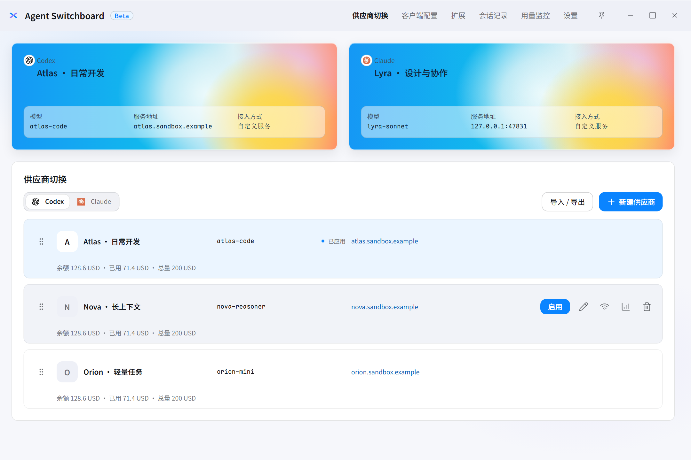
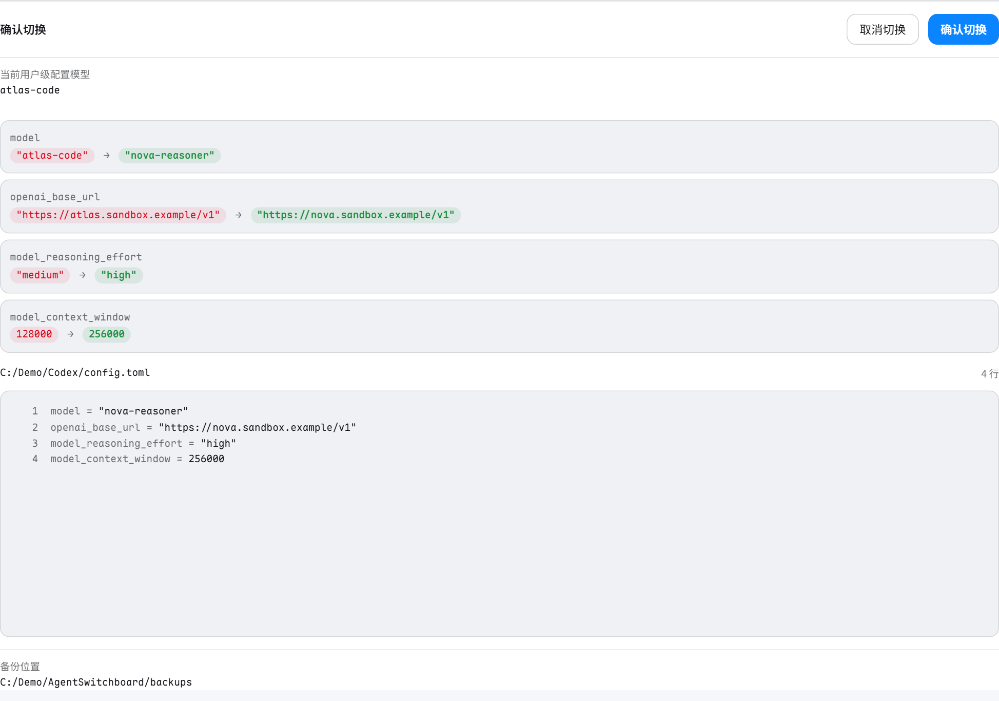
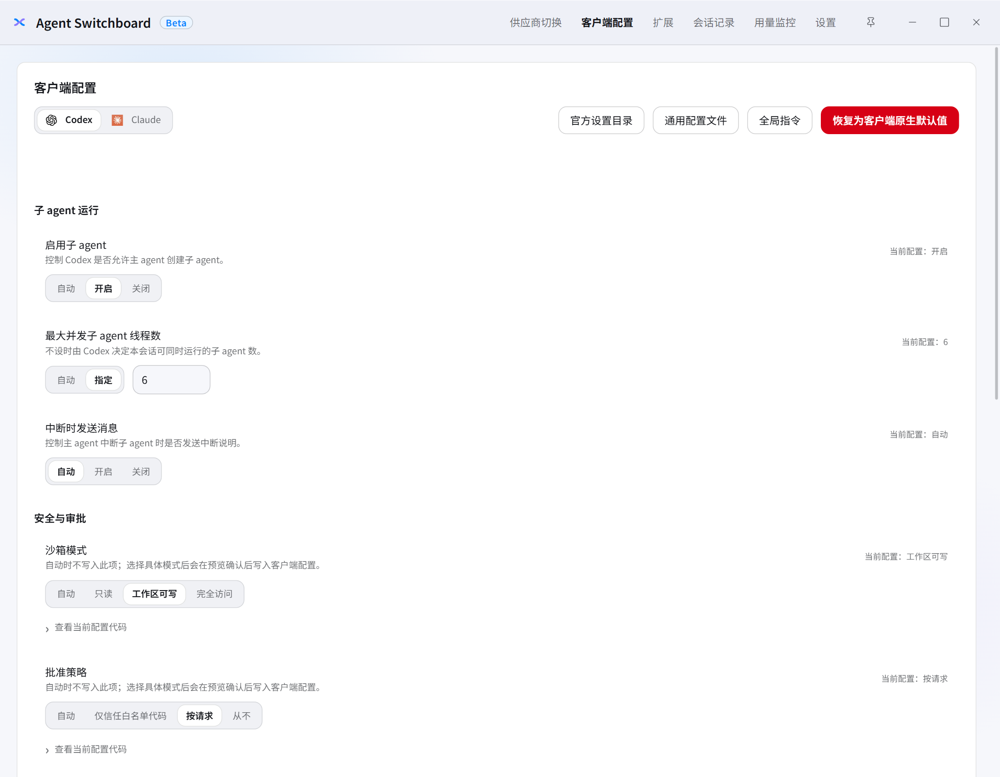
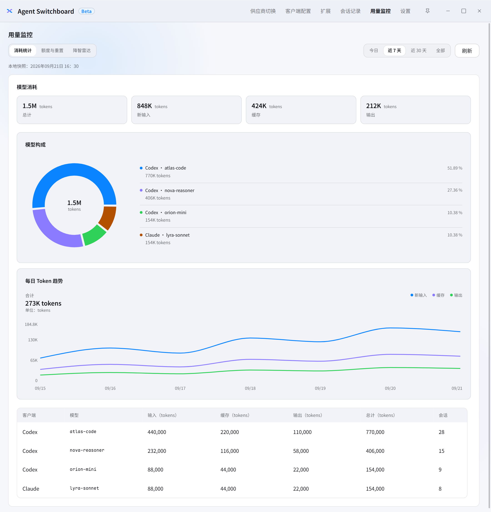
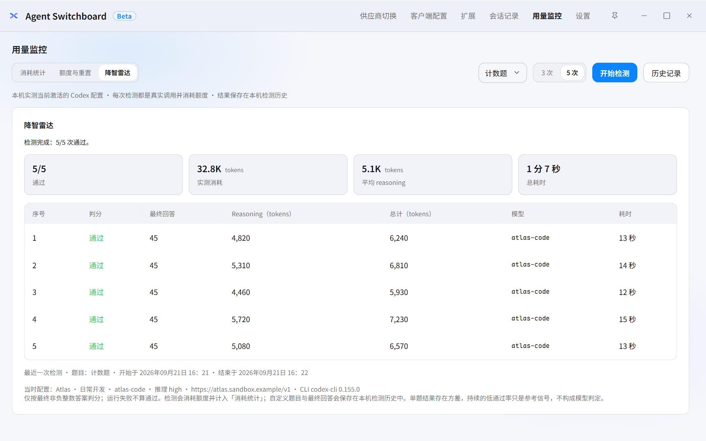
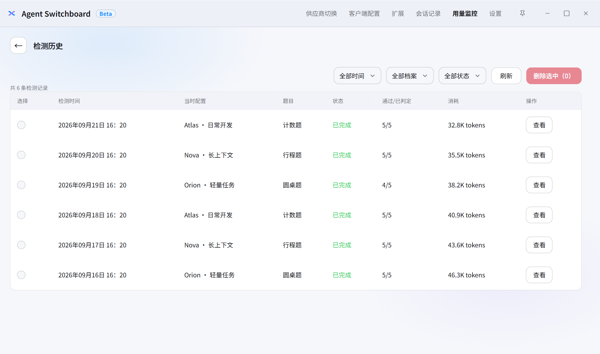
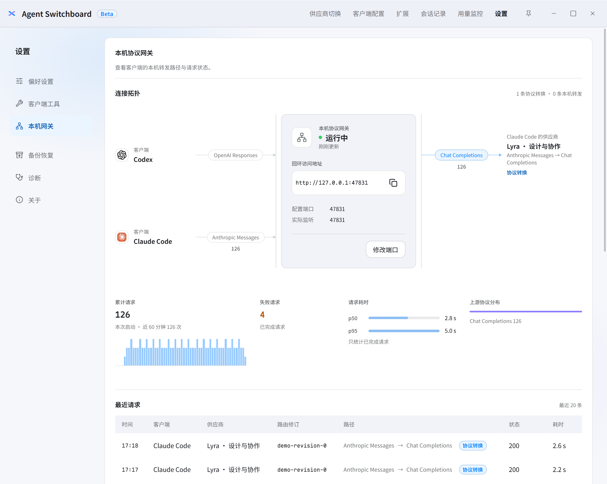

<p align="center">
  
</p>

<h1 align="center">Agent Switchboard</h1>

<p align="center">
  面向 <strong>Codex</strong> 与 <strong>Claude Code</strong> 的本地配置控制台。<br>
  管理供应商、预览配置差异、执行可恢复切换，并查看用量与检测历史。
</p>

<p align="center"><sup><a href="README.md">English</a> · 简体中文</sup></p>

将常用模型、连接信息与运行参数保存为供应商档案，切换前检查将要修改的文件和内容。客户端配置、Skills、MCP、会话记录与用量监控集中在同一桌面应用中。

## 下载与安装

前往 [GitHub Releases](https://github.com/y4Nkk/agent-switchboard/releases) 下载适合系统和处理器的安装包。以下是项目的打包平台；具体可下载文件以所选版本的 Assets 为准。此 README 描述当前源码，已发布版本的功能以对应发布说明为准。

| 平台 | 选择的文件 | 安装方式 |
| --- | --- | --- |
| Windows x64 | `*windows-x86_64-nsis.exe` | 运行安装向导；默认 NSIS 版本按当前用户安装，可选择目录 |
| macOS Apple Silicon | `*aarch64*.dmg` | 打开磁盘映像，将应用拖入 Applications |
| macOS Intel | `*x86_64*.dmg` | 打开磁盘映像，将应用拖入 Applications |
| Linux x64 | `*x86_64*.deb` 或 `*x86_64*.AppImage` | Debian/Ubuntu 使用软件包安装器；AppImage 授予执行权限后运行 |

Windows 自绘安装器需要 .NET Framework 4.8.1；应用需要 Microsoft Edge WebView2 Runtime，安装器会在缺失时尝试联网安装。Linux 的 `.deb` 包依赖 WebKitGTK 4.1。`Source code` 压缩包用于开发，`.sig`、`latest.json` 和更新归档用于更新流程。

## 首次使用

先安装并配置需要使用的 Codex 或 Claude Code 客户端，准备供应商地址、认证信息和模型名称。降智雷达还需要本机可执行的 Codex CLI。

1. 在「供应商切换」中新建档案，或从已有本机配置导入。
2. 填写连接协议、认证信息和模型；需要时到「客户端配置」调整通用设置、子代理运行设置与全局指令。
3. 预览切换，检查脱敏差异、目标文件和备份位置，再确认应用。切换保留不归该档案所有的配置键。
4. 使用客户端后，在「用量监控」查看消耗与额度，在「会话记录」查看本机会话。
5. 需要撤回配置变更时，进入「设置 → 备份恢复 → 本地备份」，选择对应记录恢复。

配置缺失、语法错误或外部修改会显示具体原因；无法确认含义的错误不会被静默覆盖。

## 界面预览

以下截图来自 **0.2.8 的真实前端界面**，在独立无头浏览器中使用模拟数据渲染。供应商、模型、余额、用量和检测记录均为演示内容，不代表真实服务或实测结果；截图过程不连接模型服务，也不读取个人配置或凭据。

**供应商总览** — 同时查看 Codex 与 Claude Code 的当前连接，管理档案并查看余额。



<details>
<summary>切换预览：确认差异后再应用</summary>

查看模型、服务地址和运行参数的变更，以及目标配置文件和备份位置。



</details>

<details>
<summary>客户端配置：子 agent、安全与审批</summary>

配置子 agent 开关与并发数，查看沙箱和审批选项的当前值。



</details>

<details>
<summary>用量统计：模型占比与每日趋势</summary>

按时间范围查看输入、缓存和输出 Token，结合模型构成、每日趋势与会话数了解消耗。



</details>

<details>
<summary>降智雷达：批次结果与逐次明细</summary>

查看通过数、Token 消耗、推理 Token 和每次运行的最终回答与耗时。图中结果为模拟数据。



</details>

<details>
<summary>检测历史：按时间、档案和状态筛选</summary>

浏览历史批次的当时配置、题目、通过数和消耗，并进入详情。



</details>

<details>
<summary>本机网关：协议拓扑与请求状态</summary>

查看回环地址、协议转换路径、请求数量、失败数和耗时分布。



</details>

## 核心功能

| 入口 | 可以做什么 |
| --- | --- |
| 供应商切换 | 新建、编辑、排序、导入和删除档案；管理模型、认证、协议、模型映射与运行参数；导出供应商 SQL 文件 |
| 客户端配置 | 管理通用设置、Codex 子代理运行设置与全局指令；预览并应用配置草稿，受控编辑界面未覆盖的字段 |
| 扩展 | 管理 Skills 与 MCP，支持客户端启停、搜索、更新、导入导出、本机发现及高级管理 |
| 会话记录 | 查看本机 Codex 与 Claude Code 会话 |
| 用量监控 | 查看消耗统计、额度与重置时间，运行降智雷达并浏览检测历史 |
| 设置 → 客户端工具 | 保存和恢复 Codex 工作场景；管理 Claude 客户端集成 |
| 设置 → 偏好设置 | 调整 90%、100%、110%、125% 界面缩放，录制全局快捷键，选择启动页 |
| 设置 → 本机网关 / 诊断 | 查看协议网关状态、配置与环境问题、运行日志 |

Codex 工作场景保存已有供应商、扩展与指令的组合，恢复前展示变更预览。全局快捷键用于显示并聚焦主窗口，窗口已聚焦时将其隐藏到托盘；启动页可选供应商列表或上次访问的顶层页面，不恢复编辑草稿。无法读取的偏好设置需明确修复，修复只重置应用偏好。

供应商切换与配置草稿写入需要预览和确认，并提供备份与恢复。扩展操作默认即时执行；敏感连接数据、删除仍有安装的定义、停用 Claude 项目共享 Skill 等操作会额外确认。

### 额度缓存与降智雷达

供应商余额与 Codex 官方额度按档案设置的间隔在后台刷新，切换页面或隐藏到托盘后仍继续。列表和托盘共用缓存，进入页面不会额外查询；刷新间隔设为 `0` 时只手动查询。

在「用量监控 → 降智雷达」中，用内置或自定义题目批量检测当前激活的 Codex 配置：

- **检测结果**：仅对成功完成的回答按最终非负整数答案判分。失败、取消、中断记为「未判定」；检测期间配置或有效路由改变会终止当前调用。
- **用量消耗**：检测会实际调用供应商并消耗额度，用量计入统计。按本次 CLI 会话读取推理 token 和消耗；缺失数据展示未知，部分汇总注明覆盖次数。结果是参考信号，不能据此判定实际模型身份。
- **历史记录**：题目、期望答案、结果、CLI 版本和当时配置快照保存在本机，不保存凭据。刷新或重启后可查看；档案改名或删除不改写历史，异常退出保留已完成结果并标记中断，重启不自动续跑。
- **历史操作**：支持时间、档案、状态筛选，分页和详情查看；可按历史题目、答案与次数重新检测。重新检测会发起新调用；删除仅删除雷达记录。结果保存失败时会提示原因，并阻止新检测及正常退出，直到保存成功。

### 子代理模型与协议网关

Codex 的默认子代理模型可选择其他已保存、未绑定账号的档案中的模型。请求使用目标档案的认证、协议、模型映射和运行参数，用量归属目标档案。引用失效时明确报错，失败不回退主模型；仍被引用的档案和模型不能删除。修改目标档案时，会同步预览并更新受影响的活动模型目录。

需要协议转换或子代理路由时，应用使用仅监听 `127.0.0.1` 的本机网关。使用这些路由期间需保持应用运行。

| 客户端 | 原生上游 | 可转换的上游 |
| --- | --- | --- |
| Codex（Responses） | Responses | Chat Completions、Anthropic Messages |
| Claude Code（Anthropic Messages） | Anthropic Messages | Chat Completions、Responses、Gemini |

协议转换有明确边界：无法无损表达的字段与工具会报错，部分仅影响计量或缓存的元数据在校验后丢弃。Codex 跨协议请求要求 `store=false`，续接上下文由本机历史补全；切换档案或密钥后旧的加密续接会被拒绝。Codex WebSocket 在网关终结，上游使用 HTTP/SSE。子代理路由支持 `/responses/compact` 与 V2 Responses compaction，按目标能力处理，其他辅助操作不接受跨供应商模型引用。Claude 故障转移只执行本机 `claude-failover.json` 中明确配置的策略。

## 数据保存与功能边界

配置、缓存、会话、检测历史和诊断默认在本机保存。应用只管理 Codex 与 Claude Code，不提供遥测、应用账户体系、自动云同步、公开代理或隐式供应商切换。模型请求、额度查询、扩展下载等联网功能会连接相应服务；可选云端备份由用户主动配置并确认上传。

| 方式 | 保存与恢复的范围 |
| --- | --- |
| 本地文件备份 | 配置写入产生的文件备份，可从备份记录恢复对应变更 |
| 供应商 SQL 导出 | 全部供应商档案的完整配置，用于在应用内导入到另一设备；文件可能包含认证信息，按凭据保管 |
| 加密云端备份 | 应用配置库中的供应商档案、客户端设置和切换记录；不包含本机会话、雷达历史或本地文件备份 |

云端备份位于「设置 → 备份恢复 → 加密云端备份」。按界面教程配置自己的 Supabase 项目、Publishable key 和项目 Auth 用户，使用独立备份密码在本机加密后上传。每次上传替换该账户已有的云端备份；登录密码与备份密码不落盘，恢复需要原备份密码。

从云端恢复会替换应用内的供应商档案、客户端设置和切换记录，不直接修改 Codex / Claude Code 当前实际配置，也不删除本地文件备份。需要启用恢复的档案时，仍须预览并确认切换。

## 开发与构建

### 环境准备

使用 Node.js **22.12+（22.x）**、npm 和 Rust。平台系统依赖参见 [Tauri 官方说明](https://v2.tauri.app/start/prerequisites/)；本项目的 Rust 工具链和安装器要求如下。

| 平台 | 项目要求 |
| --- | --- |
| Windows x64 | `stable-x86_64-pc-windows-gnu`；MinGW-w64 GCC 与 binutils，确保 `gcc`、`windres` 位于 `PATH`；WebView2 Runtime |
| macOS | Rust `stable`、Xcode Command Line Tools；打包环境另备 7-Zip（CI 使用 `p7zip`） |
| Linux | Rust `stable`；WebKitGTK 4.1、编译工具及相关开发库，Ubuntu 依赖命令见下方 |

Windows 可通过 MSYS2 安装 `mingw-w64-x86_64-gcc` 和 `mingw-w64-x86_64-binutils`，并将其 `mingw64/bin` 加入 `PATH`。构建自绘安装器还需 PowerShell 7（`pwsh`）、MSBuild 和 .NET Framework 4.8.1 targeting pack（含 WPF 引用程序集）。

仓库的 `rust-toolchain.toml` 固定 Windows GNU 工具链。**macOS/Linux 每个开发或打包终端都需先覆盖为主机工具链**，与 CI 一致：

```bash
rustup toolchain install stable
export RUSTUP_TOOLCHAIN=stable
```

Ubuntu 的 CI 系统依赖：

```bash
sudo apt-get update
sudo apt-get install -y libwebkit2gtk-4.1-dev build-essential curl wget file \
  libxdo-dev libssl-dev librsvg2-dev
```

### 本地运行

在仓库根目录安装依赖并启动桌面开发：

```bash
npm ci
npm run dev:desktop
```

| 命令 | 用途 |
| --- | --- |
| `npm run dev:desktop` | 桌面应用与本机后端，Rust 开发输出位于 `target-dev/` |
| `npm run dev` | 浏览器开发入口与同一本机后端，前端地址为 `http://127.0.0.1:1420` |
| `npm run dev:frontend` | 仅启动 Vite；单独运行不提供完整的本机业务功能 |
| `npm run build` | TypeScript 检查与前端生产构建，输出到 `dist/` |
| `npm run typecheck` | 仅检查 TypeScript 类型 |

开发入口使用真实本机后端。涉及配置写入的开发验证须使用隔离目录；执行检查前遵循 [AGENTS.md](AGENTS.md)。当前 `package.json` 没有 `test` 脚本。

### 构建安装包

在对应目标系统上运行：

| 平台 / 安装方式 | 命令 |
| --- | --- |
| Windows，当前用户、可选目录 | `npm run tauri:build:windows` |
| Windows，所有用户、Program Files | `npm run tauri:build:windows:msi` |
| macOS | `npm run tauri:build:macos` |
| Linux | `npm run tauri:build:linux` |

Windows 两个命令分别将 NSIS 或 MSI 引擎封装为自绘 `.exe` 安装器，成品位于 `target/release/bundle/installer/`。macOS 和 Linux 安装包位于 `target/release/bundle/` 下的相应格式目录。设置 `CARGO_TARGET_DIR` 时输出跟随该目录。

版本由 [Cargo.toml](Cargo.toml) 的工作区版本统一管理。完整脚本见 [package.json](package.json)，各平台构建矩阵与发布步骤见 [打包工作流](.github/workflows/package.yml)。本地构建不会自动发布版本。

## 项目文档

| 文档 | 内容 |
| --- | --- |
| [README.md](README.md) / [中文版](README.zh-CN.md) | 当前产品能力、使用方式与开发入口 |
| [DESIGN.md](DESIGN.md) | 视觉、交互、布局与可访问性契约 |
| [CHANGELOG.md](CHANGELOG.md) | 版本变更记录 |
| [AGENTS.md](AGENTS.md) | 贡献规则、改动范围与验证约束 |

## 许可证

本仓库中由 Agent Switchboard 编写的源码与文档以 [MIT License](LICENSE) 发布。第三方依赖和数据继续遵守各自许可证；本许可证不授予第三方商标的使用权。

`Codex`、`Claude Code` 及相关商标归其各自权利人所有。Agent Switchboard 与 OpenAI、Anthropic 均无隶属、认可或合作关系。
