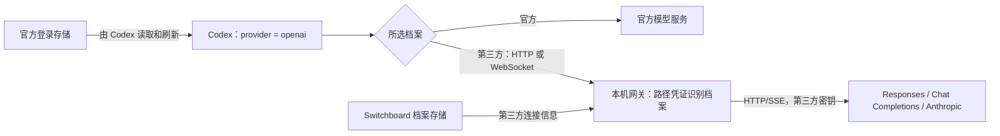

# Codex 固定 openai、保留官方登录：实施设计

状态：代码实现完成；验证结果与客户端覆盖边界见第 12 节。日期：2026-09-08。

## 1. 已确认的产品决定

- Codex 的 `model_provider` 和本产品中对应的 provider 显示名称统一为小写 `openai`。配置、状态、预览及诊断中的 provider 名称保持一致；`OpenAi` 和 `agent_switchboard` 都不再是本产品写出的 provider ID。
- 默认保留官方登录，不提供“保留登录”或“统一历史”开关。
- 用户先完成官方登录，才能激活 Codex 第三方档案。没有登录时引导登录，不创建 API-key 登录身份。
- 官方订阅的模型请求直接访问官方；所有 Codex 第三方模型请求经过本机网关。Claude Code 沿用自身既有路由规则。
- 切换、恢复备份、切换失败回滚、改端口和启动恢复均不写入、删除或恢复 Codex 的 `auth.json`，也不修改钥匙串凭据。
- 会话文件和会话数据库不属于切换器的写入范围。固定 provider 统一的是后续会话身份，不能保证任意后端之间都能继续包含加密内容的旧会话。

这些决定取代之前“第三方使用自定义 provider，可靠关闭客户端 WebSocket”的设计。新的保证是：Codex 到本机支持 HTTP/SSE 和 WebSocket，本机到第三方只使用 HTTP/SSE。

## 2. 依据及验证边界

已读取任务 `01a07e97-181b-7bf0-a5ff-9b2e7b45b10f` 及其来源任务。该任务引入 `agent_switchboard` 的直接原因是内置 `openai` 的 WebSocket 能力不能通过自定义 provider 表可靠覆盖；同时完成了端点解析、standard/minimal 请求模式和上游诊断修复。本设计保留后三项，替换 provider 与传输策略。

本地 Codex CLI `0.153.4` 的隔离探针已经证明：使用假官方登录、`model_provider = "openai"` 和本机 `openai_base_url`，模型请求会到达该本机地址，携带官方登录身份头；`auth.json` 保持不变，生成的会话元数据使用 `openai`。探针在捕获请求后终止，不能据此宣称完整回复、多轮、桌面客户端或压缩已经通过。

官方源代码核对固定到 `e7637306bc9246a3e42e407cb94f96b7ed345e3e`。内置 provider 支持 `openai_base_url`，保持官方认证能力，并启用远程压缩。本次实现同时补齐生成、WebSocket 续接与两种压缩入口。

## 3. 最终配置和数据流

官方档案：

```toml
model_provider = "openai"
# 不存在本产品拥有的 openai_base_url 覆盖。
```

第三方档案：

```toml
model_provider = "openai"
openai_base_url = "http://127.0.0.1:<port>/codex/<capability>/v1"
```

`<capability>` 是本机路由凭证，示例不是可直接使用的配置。模型和被选中覆盖层拥有的参数继续按既有规则投影。不得生成 `[model_providers.openai]`，不得投影第三方密钥、占位 API key、`env_key` 或 `experimental_bearer_token`。



只覆盖模型服务地址，不改 `chatgpt_base_url`。登录、订阅信息等官方账户请求保留官方路径；“全部走网关”仅指 Codex 的第三方模型流量。

## 4. 所有权与唯一事实来源

| 事实 | 唯一所有者 | 规则 |
| --- | --- | --- |
| Codex provider ID、配置键所有权 | `asb-core/ownership` | 唯一当前值 `openai`；对应的产品显示名称使用同一值 |
| 上游地址、密钥、协议、请求模式 | `ProviderProfile` | 不为客户端投影篡改原档案 |
| 客户端最终连接地址 | `SwitchPlan` 的类型化投影 | 官方直连或 Codex 网关，不允许第三方 Codex 直连 |
| 已激活档案、路由指纹、安装秘密 | `gateway` 与现有持久化机制 | 路由与预览、提交、恢复使用同一契约 |
| 官方登录状态 | 官方登录模块的只读观察器 | 预检、状态和额度入口共享结果，不从路由推断登录 |
| 真实配置写入和回滚 | `asb-switch` 执行器 | 仅写当前契约拥有的配置，不写认证存储 |
| 压缩与协议转换 | `gateway/transform` | 明确区分请求传输、协议转换、历史压缩 |

`requires_gateway()` 对所有第三方 Codex 档案返回 true。另行明确“是否需要协议转换”，避免将经过网关等同于跨协议；否则原生 Responses 的网页搜索等设置会被现有派生逻辑误关。

`ResponsesOptions` 保留 `requestMode: standard | minimal`，删除 `supportsWebsockets` 字段及其 UI、默认值和消费者。它原先控制的第三方 WebSocket 路径已删除，不能留下无效设置。

## 5. 登录前提与账户状态

激活第三方前检查当前有效的官方登录状态，返回明确的“已配置官方登录 / 未登录 / API-key 模式 / 存储不可读或不受支持”。“已配置”不表示已经在线验证令牌仍然有效；切换不主动刷新 OAuth。

本产品现有官方登录流程以文件存储为基础。实施时必须核对 `cli_auth_credentials_store`：不能将 keyring/auto 模式下一个残留文件误判成有效登录。首版支持范围明确为本产品已验证的文件官方登录；其他存储模式在预检时说明原因，不静默改存储方式或增加文件回退。扩展存储支持需要独立完成凭据观察与额度读取的同一契约。

由旧切换路径留下的 `auth_mode = "apikey"` 不能仅因仍存在 OAuth 字段就被自动改回官方登录。提示用户重新完成官方登录，凭据仅由明确的登录动作或 Codex 自身维护。

账户状态和路由状态分开展示：“官方账号已登录”与“当前使用某第三方”可以同时成立；额度面板仍展示官方订阅额度，但不能把网关用量计入官方额度。Codex 外部启动参数、环境变量或其他配置层覆盖了本产品投影时，诊断为配置被覆盖，不宣称切换已对该运行进程生效。

## 6. 网关身份与认证隔离

Codex 的 OAuth Bearer 和账户 ID 会到达本机网关。它们既不是第三方凭据，也不是网关路由凭据。Codex 入口只从严格匹配的路径中提取 capability，并绑定到当前激活的 Codex 档案；取消 Codex 入口对 Authorization 中 `asb_local_*` 的识别。Claude 的 Bearer 入口是另一客户端契约，按既有规则保留。

capability 使用安装级随机秘密、档案 ID、有效上游路由指纹进行带用途域隔离的确定性派生；不能只以配置指纹作为档案身份。改名称、模型显示信息、重启或改监听端口不改变 capability；修改上游地址、密钥、协议或请求模式会更换路由代际。相同连接参数的两个档案仍能分别识别。

路由凭证只授权该档案的指定操作，不接受 URL 中的任意代理目标。仅监听 loopback，严格限制方法和路径。日志、诊断、配置预览和导出必须遮蔽 capability；将完整本机 URL 当作敏感信息处理。

上游请求从允许字段重新构造头部，使用档案密钥。不得透传官方 OAuth、账户 ID、Cookie 或客户端 Authorization；保持禁用自动重定向，避免头部与凭据被转交到另一地址。

未知或已撤销 capability 返回本机 403。第三方 401 转为网关 502 和 `upstream_authentication_failed`，同时在脱敏诊断中保存 `upstreamStatus = 401`、原始错误摘要、request ID 和实际端点。HTTP 与 WebSocket 采用一致规则，防止客户端将第三方错误当成官方登录 401 并启动令牌刷新。

保留之前任务建立的诊断能力：区分 clientStatus 与 upstreamStatus，保留 400/404/429 等实际来源；不能再次退化为笼统 UTF-8 或“转换失败”。不得自动切回官方或其他第三方。

## 7. 请求、WebSocket 与多轮

所有第三方上游使用 HTTP/SSE；standard 保留协议允许的 Responses 字段，minimal 使用已有的明确字段裁剪契约。端点继续由共享解析器处理 API 前缀与完整端点，不猜测或补写 `/v1`。

Codex 入口至少覆盖：

| 操作 | 处理方式 |
| --- | --- |
| POST `.../responses` | HTTP/SSE 生成，按上游协议投影 |
| GET `.../responses` 的 WebSocket upgrade | 本机接收，逐轮转为上游 HTTP/SSE |
| POST `.../responses/compact` | 网关历史压缩，返回合法 compact 输出 |
| Responses 输入中的 `compaction_trigger` | 按压缩语义处理，支持相应流事件 |

对受支持 Codex 版本实际访问的模型发现等其他模型路由进行抓包清单验证；若会访问，需在同一版本完成明确的端点和响应契约。不得用任意路径透传、空模型列表或伪成功掩盖遗漏。账户路径不纳入此路由表。

必须修复现有 WebSocket 上下文只在非 Responses 上游记录完成结果的问题。原生 Responses 也要记录完整 response ID 与输出，第二轮 `previous_response_id` 才有来源。传输封装与跨协议规范化分离，不能让原生 Responses 经过会丢失原生工具项的转换器。

minimal 模式裁剪 `previous_response_id` 前，先正确重建完整输入。缓存未命中时明确返回 `previous_response_not_found`；不能发起失去前文的新请求。缓存必须限定档案/路由和连接语义，防止串会话。`generate: false` 预热不调用上游、不产生计费。

空闲 WebSocket 连接不能长期占满现有 8 个请求工作线程。分离连接生命周期与正在执行的生成请求，保留有界连接数、请求数、超时和取消机制。改端口或退出时 drain 的是正在执行的请求，空闲连接主动关闭，不能无限等待。

路由切换后，已经被接受的请求在原路由快照上完成；旧连接的新请求必须拒绝，不能悄悄发送给新档案。已启动的 Codex 进程可能缓存配置，界面说明需要新请求上下文或重启客户端生效，不能承诺即时改变所有运行中的会话。

## 8. 历史压缩是首版必需项

固定内置 `openai` 会触发 Codex 远程压缩能力。旧式请求是 `/responses/compact`；核对的源代码还包含以 `compaction_trigger` 发起生成流、要求恰好一个 `compaction` 输出项的 V2 路径。它们是客户端协议操作，不能把支持这两种操作当作保留旧 Switchboard 契约。

采用一个网关压缩实现，统一使用当前第三方模型生成可继续工作的摘要：输入包括任务目标、约束、已完成动作、关键文件和待办；将历史作为待总结的数据，不作为压缩器新指令；关闭工具执行，限制输出预算。不能把压缩直接转发给不一定支持 compact 的第三方，也不通过关闭 Codex 的压缩功能绕开实现。

压缩摘要封装为网关自己拥有的加密 compaction 载荷，带独立用途标记、档案身份、协议版本和认证加密。它不是伪造的 OpenAI 加密内容。后续请求进入同一网关时解封为明确的上下文摘要，再投影给第三方。

- 旧式入口返回客户端接受的 compact 输出结构；V2 通过正常 SSE/WS 事件返回恰好一个 compaction 项和完整的 response.completed。
- 摘要失败、响应截断、取消、预算不足或验证失败均返回失败，不能产生空摘要或成功标记；客户端原历史仍可保留。
- 处理重复压缩和此前网关 compaction 载荷，避免无限叠加摘要封装；正确保留客户端在压缩后重新注入的指令与最近消息。
- 同档案重启后应能解封，不能依赖进程内 response 缓存。用途隔离的加密密钥从安装秘密和明确的档案/后端域派生，不能直接绑定会因改端口或凭证更新而失效的访问 token。
- 推理续接也必须与访问 capability 解耦；后端域至少区分端点和协议，不能将其他后端加密内容当作本后端可读数据。删除旧 token 派生的当前执行路径，不增加双解密器。

真实 CLI 的手动压缩、自动压缩、压缩后工具调用和重启续聊均列入验收；仅验证 JSON 结构不足以验收。实际结果见本文验收记录。

## 9. 切换、恢复和启动的事务

预览阶段读取目标配置、当前档案和官方登录状态；准备类型化路由，检查端口可用，生成脱敏的配置差异。不把认证文件内容或哈希纳入写入前置条件，避免 Codex 正常刷新令牌造成切换冲突。

提交沿用既有 journal/备份/恢复机制，覆盖配置、路由激活状态及本应用档案变更：准备并验证新路由，记录恢复信息，原子写入配置，提交一致的激活状态，再撤销旧路由的新请求权限。跨文件不能宣称真正的原子提交，必须为每个崩溃点设计恢复结果。

切换失败只回滚本事务拥有的配置和应用状态。未能完成回滚时保留具体 journal 和诊断，禁止继续叠加配置写入，提供明确恢复入口；绝不回写旧 OAuth 或恢复旧 `auth_mode`。

新备份仅包含本次可恢复配置和类型化路由引用。恢复前验证备份契约、目标档案及有效指纹，重新解析当前监听地址；档案已删除或有效连接已改变时明确拒绝，不能拿最新密钥假冒旧路由。旧端口不能作为还活着的端点直接恢复。

启动恢复从应用路由状态和当前配置中的 capability 恢复，不读取 API key 来猜测当前档案。监听失败则展示不可用，保留配置供显式恢复；不回退直连或自动切换官方。安装秘密丢失时不得静默生成新身份并宣称现有路由、加密历史仍可用。

改端口流程先绑定新端口、再 drain 活跃请求、提交配置与状态并关闭旧监听；移除其中 auth 快照、auth 匹配和固定 `/v1` 拼接。capability 与压缩密钥保持不变。

第三方依赖 Switchboard 网关运行。最小化到托盘可以继续运行；明确退出会停用网关，说明影响，不自动改回官方。本次不增加系统服务、后台守护安装或自动代理功能。

## 10. 旧数据与“无兼容、无过渡”的具体含义

运行时只保留新契约：不双读新旧 provider，不双写认证，不保留第三方直连，不自动探测并降级，不增加功能开关。删除旧字段后校验器严格拒绝旧形状。

已有应用档案需要一次性的、版本明确的存储转换：保留 ID、地址、密钥、协议、requestMode 与其他业务字段，删除已取消的 `supportsWebsockets`，重建新路由状态；转换前备份，失败完整恢复。该过程归已有 storage migration 模块，不进入正常 profile 解析器。迁移报告明确说明传输政策已经统一，不能静默重解释原来的 true。

用户真实 Codex 配置的升级只发生在显式切换事务中。把已知由本产品拥有的旧 provider 键移除；`agent_switchboard`、更早的 `OpenAi` 等清理由一次性转换负责，不作为新 overlay 的永久兼容字段。保留不属于本产品的键。未经转换的旧配置标为待重新应用，不当作新路由已激活。

已有包含 auth 联动恢复的备份不进入新恢复执行器；保留记录和查看/导出能力，明确显示不能用当前切换器恢复。不能为了旧备份重新引入写 auth 的隐藏入口。

不迁移会话 JSONL 或 SQLite。旧 `agent_switchboard` 历史在原生 Codex 中可能仍有 provider 过滤差异；本产品的会话管理沿用已有扫描能力。旧版网关推理载荷不引入双解密兼容，新版本需要明确提示其续接限制，不删除或悄悄重写历史。

固定 `openai` 不解决不同后端的 encrypted_content 解密。官方到第三方、第三方到官方，以及不同第三方之间，遇到不属于目标后端的载荷应明确失败；不删除推理项、伪造摘要或自动换后端来使请求表面成功。

一次性数据转换属于升级动作，不能等同于永久兼容层。应用存储转换保留完整原目录并记录位置；真实 Codex 旧键清理包含在明确应用供应商时的配置预览和备份内。本次开发验证只在隔离临时目录执行，未转换用户真实存储。

## 11. 按模块落地与旧路径删除

| 范围 | 修改与删除 |
| --- | --- |
| `crates/asb-core/src/ownership/provider.rs` | 固定 openai；当前所有权只保留新投影键；旧表清理移交一次性转换 |
| `contracts/provider.rs`、`plan.rs`、`responses.rs` | 所有第三方 Codex 使用网关；保留原始上游档案；删除 WS 开关字段和直连投影 |
| `adapter/codex/{overlay,state,preview,render}.rs` | 新配置投影与匹配；拆分网关判断和跨协议能力判断 |
| `adapter/codex_auth.rs`、`crates/asb-switch/src/executor/codex.rs` | 删除 provider 切换的 auth 渲染、双文件预览、写入、备份与恢复路径；复用配置执行器 |
| `src-tauri/src/commands/switching/` | 预览、切换、档案保存、恢复统一调用新契约；账号只读预检 |
| `src-tauri/src/official_login/`、`commands/status/` | 只读登录观察与路由状态分离；明确登录动作仍由原登录流程处理 |
| `src-tauri/src/gateway/{controller,identity,routing}.rs` | 路径 capability；档案 ID 绑定；去掉从 auth.json 匹配路由 |
| `gateway/server/`、`server/websocket/` | 新路径分发、401 隔离、原生 Responses 多轮缓存、连接与请求生命周期拆分 |
| `gateway/transform/` | 压缩操作及载荷；续接密钥与访问 token 解耦；保留端点、minimal、错误契约 |
| `gateway/port_change/`、`config_store/` | 不带 auth 的改端口、启动恢复、版本转换和新备份校验 |
| `src/components/provider-editor/`、前端类型与调用者 | 删除 WS 开关；保留 standard/minimal 与现有分组；展示官方登录前提和网关依赖 |
| 导入、探测、网站配置生成、夹具与示例 | 同步新字段和新路由规则，防止旁路重新生成旧配置 |
| README、DESIGN、CHANGELOG、progress | 更新当前产品事实，记录本次替代关系；历史验证记录不改写成新实现证据 |

按“核心契约 → 网关和压缩 → 执行事务 → 调用者/UI → 删除检查与验收”的依赖顺序实施，作为一个完整发布交付；不发布一半旧、一半新的混合行为。职责拆分遵守单源文件不超过 500 行、函数不超过 80 行的项目约束。

## 12. 验收清单

所有写入测试使用隔离临时目录、假认证和本机模拟上游；真实第三方访问、真实登录及真实配置写入不属于自动测试。

| 场景 | 必须证明的结果 |
| --- | --- |
| 官方 → 三种第三方协议 → 官方 | provider 标识及对应显示名称一直为小写 openai；第三方走网关；官方恢复直连；认证文件逐字节不变 |
| auth 缺失、apikey、损坏、其他存储模式 | 准确预检，未激活网关配置，无隐式认证写入或文件回退 |
| 切换期间官方令牌刷新/注销 | 切换不覆盖新的凭据或注销状态；不因认证哈希变化执行旧值恢复 |
| HTTP 与 WebSocket 生成 | 单轮、多轮、工具调用、取消、断流、预热均有正确行为 |
| Responses standard/minimal | 第二轮上下文正确；minimal 裁剪有明确契约；原生工具不因规范化丢失 |
| 第三方传输 | 所有协议无第三方 WS 尝试；端点保持上一任务修复的前缀语义 |
| OAuth 隔离 | 模拟上游与日志中不存在官方令牌/账户头；网关错误不触发 OAuth 刷新 |
| 错误诊断 | 400、401、404、429、非 JSON 和截断 SSE 保留来源、状态、request ID、脱敏端点 |
| 压缩 | 实际 CLI 手动/自动压缩、旧式/V2 协议、压缩后工具调用、重复压缩、重启续聊 |
| 历史 | 新会话元数据 openai；已有历史不写入；不支持的跨后端加密内容明确失败 |
| 路由身份 | 相同参数不同档案不混淆；端口/名称变更不失效；旧 capability 不转投新档案 |
| 生命周期 | 多个空闲 WS 不饿死 HTTP；端口变更、退出、崩溃、重启、占用端口可诊断和恢复 |
| 配置事务 | 对每个写入/持久化失败点注入故障；仅回滚配置和应用状态，不恢复 auth |
| 新旧存储 | 全新状态及一次性转换通过；运行时旧字段拒绝；旧备份不会进入 auth 恢复路径 |
| 客户端覆盖范围 | 已安装 CLI 与目标桌面版本分别验证；列出实际支持版本和未支持的认证存储 |

执行相关 Rust 契约/适配器/执行器/网关/恢复测试，前端 `npm run typecheck` 和相关测试切片；最后检查旧 ID 写入、auth 写入调用链、WS 字段、直连 Codex 路径及残留消费者。更广检查按共享契约影响扩大，不重复无新增证据的全量检查。

2026-09-08 实施验证记录：

- 核心 Rust 236 项、切换执行器 66 项、桌面 Rust 455 项通过。桌面全量默认忽略 8 项需要真实客户端或外部材料的测试，真实 Codex CLI 单独执行。测试覆盖只写配置、刷新与注销不被回滚、崩溃恢复、外改保护、明确候选版本绑定、改端口后恢复、旧字段转换和拒绝、HTTP/WS、两种压缩协议、standard/minimal 与三种上游协议。
- 已安装 Codex CLI `0.153.4` 的 5 个独立场景通过：Responses standard/minimal、Chat 转换单轮，以及手动/自动压缩。两种压缩均验证客户端进程重启、已注册动态工具恢复、真实工具调用与精确文本结果回传、摘要进入后续上游请求、官方认证文件字节不变和第三方认证隔离。动态工具只返回固定文本，不启动系统命令。最终压缩日志为 `target/codex-openai-validation/cli-compaction-tests.log`（2 passed），此前 3 个单轮通过结果记录在 `cli-tests.log`，该历史日志中的旧 shell 夹具失败不作为最终验收结果。
- 前端类型检查与生产构建通过。前端全量首轮 579/585，通过修复相关断言及切片复验 24/24 覆盖剩余失败；复用未受影响的结果。网站类型检查、24 项测试、生产构建与配置产物校验通过。
- GNU 测试链接采用当前进程的 `RUSTFLAGS=-C link-self-contained=yes`，没有修改用户工具链设置。此前研究期的链接失败不再是本轮阻塞。
- 当前支持的认证前置检查是文件官方登录；keyring、auto、ephemeral 明确拒绝。它验证文件结构与选择的存储模式，不进行在线账号有效性探测。
- 真实测试只使用临时 Codex home、虚构认证和本机模拟上游。未写用户真实配置、真实凭据、会话文件或远端业务数据；未打包、安装或发布。目标 Codex 桌面客户端、真实第三方服务及 macOS/Linux 尚未做端到端验收。
- 空闲 WS 能在退出和监听切换时主动关闭；上游已发出的阻塞 HTTP 请求在断连后仍可能等到下一次读写或既有 600 秒超时才释放，不承诺客户端取消瞬间停止第三方计费。压缩载荷的重启稳定性另由持久密钥测试覆盖。
- 环境自动审批拒绝了旧测试 shell 进程启动及公开协议临时文件清理，仅返回 `blocked by policy`。未重试被拒绝的操作；协议临时文件保留。最终工具验收使用无进程、无副作用的动态工具协议，不宣称系统命令执行成功。

## 13. 结论与外部依据

值得实现，前提是交付上面完整的网关和生命周期行为。收益是登录状态稳定、第三方密钥留在本应用、后续会话统一使用 openai；代价是第三方依赖网关运行，以及本产品必须承担内置 provider 的 WebSocket 和压缩协议。不能将“零技术债”作为未验证承诺；以旧路径确实删除、事务与真实客户端验收通过作为完成标准。

- [Codex 配置参考：model_provider、openai_base_url 与保留 provider](https://learn.chatgpt.com/docs/config-file/config-reference)
- [Codex 认证说明](https://learn.chatgpt.com/docs/auth)
- [固定版本：内置 openai provider 与认证能力](https://github.com/openai/codex/blob/e7637306bc9246a3e42e407cb94f96b7ed345e3e/codex-rs/model-provider-info/src/lib.rs)
- [固定版本：provider 的远程压缩能力](https://github.com/openai/codex/blob/e7637306bc9246a3e42e407cb94f96b7ed345e3e/codex-rs/model-provider/src/provider.rs)
- [固定版本：V2 压缩触发请求](https://github.com/openai/codex/blob/e7637306bc9246a3e42e407cb94f96b7ed345e3e/codex-rs/core/src/compact_remote_v2_attempt.rs)
- [固定版本：V2 压缩输出约束](https://github.com/openai/codex/blob/e7637306bc9246a3e42e407cb94f96b7ed345e3e/codex-rs/core/src/compact_remote_v2.rs)
- [CC Switch：统一历史及跨供应商加密内容限制](https://github.com/farion1231/cc-switch/blob/f3b18df12007d0fd79fd8ad8d310880664015197/docs/guides/codex-unified-session-history-guide-zh.md)
