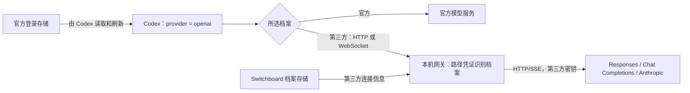

# Codex 固定 openai、保留官方登录：实施设计

状态：2026-09-08 的固定 openai 基础实现已完成，历史验证与覆盖边界见第 12 节；2026-09-10 的第三方客户端 Codex 接管代码、隔离回归与真实第三方三协议请求验收均已完成。Codex Desktop 完整闭环仍待真实桌面客户端环境。第 1–13 节描述基础版本，不代表已经与第三方客户端功能对齐。

## 1. 已确认的产品决定

- Codex 的 `model_provider` 和本产品中对应的 provider 显示名称统一为小写 `openai`。配置、状态、预览及诊断中的 provider 名称保持一致；`OpenAi` 和 `agent_switchboard` 都不再是本产品写出的 provider ID。
- 默认保留官方登录，不提供“保留登录”或“统一历史”开关。
- 用户先完成官方登录，才能激活 Codex 第三方档案。没有登录时引导登录，不创建 API-key 登录身份。
- 官方订阅的模型请求直接访问官方；所有 Codex 第三方模型请求经过本机网关。Claude Code 沿用自身既有路由规则。
- 切换、恢复备份、切换失败回滚、改端口和启动恢复均不写入、删除或恢复 Codex 的 `auth.json`，也不修改钥匙串凭据。
- 会话文件和会话数据库不属于切换器的写入范围。固定 provider 统一的是后续会话身份，不能保证任意后端之间都能继续包含加密内容的旧会话。

这些决定取代之前“第三方使用自定义 provider，可靠关闭客户端 WebSocket”的设计。新的保证是：Codex 到本机支持 HTTP/SSE 和 WebSocket，本机到第三方只使用 HTTP/SSE。

## 2. 依据及验证边界

已读取任务 `01a07e97-181b-7bf0-a5ff-9b2e7b45b10f` 及其来源任务。该任务引入 `agent_switchboard` 的直接原因是内置 `openai` 的 WebSocket 能力不能通过自定义 provider 表可靠覆盖；同时完成了端点解析、standard/minimal 请求模式和上游诊断修复。本设计保留后三项，替换 provider 与传输策略。

本地 Codex CLI `0.153.4` 的隔离探针已经证明：使用假官方登录、`model_provider = "openai"` 和本机 `openai_base_url`，模型请求会到达该本机地址，携带官方登录身份头；`auth.json` 保持不变，生成的会话元数据使用 `openai`。探针在捕获请求后终止，不能据此宣称完整回复、多轮、桌面客户端或压缩已经通过。

官方源代码核对固定到 `e7637306bc9246a3e42e407cb94f96b7ed345e3e`。内置 provider 支持 `openai_base_url`，保持官方认证能力，并启用远程压缩。本次实现同时补齐生成、WebSocket 续接与两种压缩入口。

## 3. 最终配置和数据流

官方档案：

```toml
model_provider = "openai"
# 不存在本产品拥有的 openai_base_url 覆盖。
```

第三方档案：

```toml
model_provider = "openai"
openai_base_url = "http://127.0.0.1:<port>/codex/<capability>/v1"
```

`<capability>` 是本机路由凭证，示例不是可直接使用的配置。模型和被选中覆盖层拥有的参数继续按既有规则投影。不得生成 `[model_providers.openai]`，不得投影第三方密钥、占位 API key、`env_key` 或 `experimental_bearer_token`。



只覆盖模型服务地址，不改 `chatgpt_base_url`。登录、订阅信息等官方账户请求保留官方路径；“全部走网关”仅指 Codex 的第三方模型流量。

## 4. 所有权与唯一事实来源

| 事实 | 唯一所有者 | 规则 |
| --- | --- | --- |
| Codex provider ID、配置键所有权 | `asb-core/ownership` | 唯一当前值 `openai`；对应的产品显示名称使用同一值 |
| 上游地址、密钥、协议、请求模式 | `ProviderProfile` | 不为客户端投影篡改原档案 |
| 客户端最终连接地址 | `SwitchPlan` 的类型化投影 | 官方直连或 Codex 网关，不允许第三方 Codex 直连 |
| 已激活档案、路由指纹、安装秘密 | `gateway` 与现有持久化机制 | 路由与预览、提交、恢复使用同一契约 |
| 官方登录状态 | 官方登录模块的只读观察器 | 预检、状态和额度入口共享结果，不从路由推断登录 |
| 真实配置写入和回滚 | `asb-switch` 执行器 | 仅写当前契约拥有的配置，不写认证存储 |
| 压缩与协议转换 | `gateway/transform` | 明确区分请求传输、协议转换、历史压缩 |

`requires_gateway()` 对所有第三方 Codex 档案返回 true。另行明确“是否需要协议转换”，避免将经过网关等同于跨协议；否则原生 Responses 的网页搜索等设置会被现有派生逻辑误关。

`ResponsesOptions` 保留 `requestMode: standard | minimal`，删除 `supportsWebsockets` 字段及其 UI、默认值和消费者。它原先控制的第三方 WebSocket 路径已删除，不能留下无效设置。

## 5. 登录前提与账户状态

激活第三方前检查当前有效的官方登录状态，返回明确的“已配置官方登录 / 未登录 / API-key 模式 / 存储不可读或不受支持”。“已配置”不表示已经在线验证令牌仍然有效；切换不主动刷新 OAuth。

本产品现有官方登录流程以文件存储为基础。实施时必须核对 `cli_auth_credentials_store`：不能将 keyring/auto 模式下一个残留文件误判成有效登录。首版支持范围明确为本产品已验证的文件官方登录；其他存储模式在预检时说明原因，不静默改存储方式或增加文件回退。扩展存储支持需要独立完成凭据观察与额度读取的同一契约。

由旧切换路径留下的 `auth_mode = "apikey"` 不能仅因仍存在 OAuth 字段就被自动改回官方登录。提示用户重新完成官方登录，凭据仅由明确的登录动作或 Codex 自身维护。

账户状态和路由状态分开展示：“官方账号已登录”与“当前使用某第三方”可以同时成立；额度面板仍展示官方订阅额度，但不能把网关用量计入官方额度。Codex 外部启动参数、环境变量或其他配置层覆盖了本产品投影时，诊断为配置被覆盖，不宣称切换已对该运行进程生效。

## 6. 网关身份与认证隔离

Codex 的 OAuth Bearer 和账户 ID 会到达本机网关。它们既不是第三方凭据，也不是网关路由凭据。Codex 入口只从严格匹配的路径中提取 capability，并绑定到当前激活的 Codex 档案；取消 Codex 入口对 Authorization 中 `asb_local_*` 的识别。Claude 的 Bearer 入口是另一客户端契约，按既有规则保留。

capability 使用安装级随机秘密、档案 ID、有效上游路由指纹进行带用途域隔离的确定性派生；不能只以配置指纹作为档案身份。改名称、模型显示信息、重启或改监听端口不改变 capability；修改上游地址、密钥、协议或请求模式会更换路由代际。相同连接参数的两个档案仍能分别识别。

路由凭证只授权该档案的指定操作，不接受 URL 中的任意代理目标。仅监听 loopback，严格限制方法和路径。日志、诊断、配置预览和导出必须遮蔽 capability；将完整本机 URL 当作敏感信息处理。

上游请求从允许字段重新构造头部，使用档案密钥。不得透传官方 OAuth、账户 ID、Cookie 或客户端 Authorization；保持禁用自动重定向，避免头部与凭据被转交到另一地址。

未知或已撤销 capability 返回本机 403。第三方 401 转为网关 502 和 `upstream_authentication_failed`，同时在脱敏诊断中保存 `upstreamStatus = 401`、原始错误摘要、request ID 和实际端点。HTTP 与 WebSocket 采用一致规则，防止客户端将第三方错误当成官方登录 401 并启动令牌刷新。

保留之前任务建立的诊断能力：区分 clientStatus 与 upstreamStatus，保留 400/404/429 等实际来源；不能再次退化为笼统 UTF-8 或“转换失败”。不得自动切回官方或其他第三方。

## 7. 请求、WebSocket 与多轮

所有第三方上游使用 HTTP/SSE；standard 保留协议允许的 Responses 字段，minimal 使用已有的明确字段裁剪契约。端点继续由共享解析器处理 API 前缀与完整端点，不猜测或补写 `/v1`。

Codex 入口至少覆盖：

| 操作 | 处理方式 |
| --- | --- |
| POST `.../responses` | HTTP/SSE 生成，按上游协议投影 |
| GET `.../responses` 的 WebSocket upgrade | 本机接收，逐轮转为上游 HTTP/SSE |
| POST `.../responses/compact` | 网关历史压缩，返回合法 compact 输出 |
| Responses 输入中的 `compaction_trigger` | 按压缩语义处理，支持相应流事件 |

对受支持 Codex 版本实际访问的模型发现等其他模型路由进行抓包清单验证；若会访问，需在同一版本完成明确的端点和响应契约。不得用任意路径透传、空模型列表或伪成功掩盖遗漏。账户路径不纳入此路由表。

必须修复现有 WebSocket 上下文只在非 Responses 上游记录完成结果的问题。原生 Responses 也要记录完整 response ID 与输出，第二轮 `previous_response_id` 才有来源。传输封装与跨协议规范化分离，不能让原生 Responses 经过会丢失原生工具项的转换器。

minimal 模式裁剪 `previous_response_id` 前，先正确重建完整输入。缓存未命中时明确返回 `previous_response_not_found`；不能发起失去前文的新请求。缓存必须限定档案/路由和连接语义，防止串会话。`generate: false` 预热不调用上游、不产生计费。

空闲 WebSocket 连接不能长期占满现有 8 个请求工作线程。分离连接生命周期与正在执行的生成请求，保留有界连接数、请求数、超时和取消机制。改端口或退出时 drain 的是正在执行的请求，空闲连接主动关闭，不能无限等待。

路由切换后，已经被接受的请求在原路由快照上完成；旧连接的新请求必须拒绝，不能悄悄发送给新档案。已启动的 Codex 进程可能缓存配置，界面说明需要新请求上下文或重启客户端生效，不能承诺即时改变所有运行中的会话。

## 8. 历史压缩是首版必需项

固定内置 `openai` 会触发 Codex 远程压缩能力。旧式请求是 `/responses/compact`；核对的源代码还包含以 `compaction_trigger` 发起生成流、要求恰好一个 `compaction` 输出项的 V2 路径。它们是客户端协议操作，不能把支持这两种操作当作保留旧 Switchboard 契约。

采用一个网关压缩实现，统一使用当前第三方模型生成可继续工作的摘要：输入包括任务目标、约束、已完成动作、关键文件和待办；将历史作为待总结的数据，不作为压缩器新指令；关闭工具执行，限制输出预算。不能把压缩直接转发给不一定支持 compact 的第三方，也不通过关闭 Codex 的压缩功能绕开实现。

压缩摘要封装为网关自己拥有的加密 compaction 载荷，带独立用途标记、档案身份、协议版本和认证加密。它不是伪造的 OpenAI 加密内容。后续请求进入同一网关时解封为明确的上下文摘要，再投影给第三方。

- 旧式入口返回客户端接受的 compact 输出结构；V2 通过正常 SSE/WS 事件返回恰好一个 compaction 项和完整的 response.completed。
- 摘要失败、响应截断、取消、预算不足或验证失败均返回失败，不能产生空摘要或成功标记；客户端原历史仍可保留。
- 处理重复压缩和此前网关 compaction 载荷，避免无限叠加摘要封装；正确保留客户端在压缩后重新注入的指令与最近消息。
- 同档案重启后应能解封，不能依赖进程内 response 缓存。用途隔离的加密密钥从安装秘密和明确的档案/后端域派生，不能直接绑定会因改端口或凭证更新而失效的访问 token。
- 推理续接也必须与访问 capability 解耦；后端域至少区分端点和协议，不能将其他后端加密内容当作本后端可读数据。删除旧 token 派生的当前执行路径，不增加双解密器。

真实 CLI 的手动压缩、自动压缩、压缩后工具调用和重启续聊均列入验收；仅验证 JSON 结构不足以验收。实际结果见本文验收记录。

## 9. 切换、恢复和启动的事务

预览阶段读取目标配置、当前档案和官方登录状态；准备类型化路由，检查端口可用，生成脱敏的配置差异。不把认证文件内容或哈希纳入写入前置条件，避免 Codex 正常刷新令牌造成切换冲突。

提交沿用既有 journal/备份/恢复机制，覆盖配置、路由激活状态及本应用档案变更：准备并验证新路由，记录恢复信息，原子写入配置，提交一致的激活状态，再撤销旧路由的新请求权限。跨文件不能宣称真正的原子提交，必须为每个崩溃点设计恢复结果。

切换失败只回滚本事务拥有的配置和应用状态。未能完成回滚时保留具体 journal 和诊断，禁止继续叠加配置写入，提供明确恢复入口；绝不回写旧 OAuth 或恢复旧 `auth_mode`。

新备份仅包含本次可恢复配置和类型化路由引用。恢复前验证备份契约、目标档案及有效指纹，重新解析当前监听地址；档案已删除或有效连接已改变时明确拒绝，不能拿最新密钥假冒旧路由。旧端口不能作为还活着的端点直接恢复。

启动恢复从应用路由状态和当前配置中的 capability 恢复，不读取 API key 来猜测当前档案。监听失败则展示不可用，保留配置供显式恢复；不回退直连或自动切换官方。安装秘密丢失时不得静默生成新身份并宣称现有路由、加密历史仍可用。

改端口流程先绑定新端口、再 drain 活跃请求、提交配置与状态并关闭旧监听；移除其中 auth 快照、auth 匹配和固定 `/v1` 拼接。capability 与压缩密钥保持不变。

第三方依赖 Switchboard 网关运行。最小化到托盘可以继续运行；明确退出会停用网关，说明影响，不自动改回官方。本次不增加系统服务、后台守护安装或自动代理功能。

## 10. 旧数据与“无兼容、无过渡”的具体含义

本节是 2026-09-08 基础版本的历史说明，包含一次性存储转换的旧提案，现已废止且不得用于实现。当前唯一有效规则见第 14.0 节：不迁移、不兼容、不读取旧状态；不同上游的 `encrypted_content` 也只能明确拒绝，不能伪造、删除或转换。

## 11. 按模块落地与旧路径删除

本节的模块清单属于基础版本，不能作为第 14 节的实现清单。完整的新契约以第 14.3 节的类型和第 14.4 节的阶段为准；其中没有旧字段清理迁移、旧 capability 恢复或 auth 写入路径。

| 范围 | 修改与删除 |
| --- | --- |
| `crates/asb-core/src/ownership/provider.rs` | 固定 openai；当前所有权只保留新投影键；旧表清理移交一次性转换 |
| `contracts/provider.rs`、`plan.rs`、`responses.rs` | 所有第三方 Codex 使用网关；保留原始上游档案；删除 WS 开关字段和直连投影 |
| `adapter/codex/{overlay,state,preview,render}.rs` | 新配置投影与匹配；拆分网关判断和跨协议能力判断 |
| `adapter/codex_auth.rs`、`crates/asb-switch/src/executor/codex.rs` | 删除 provider 切换的 auth 渲染、双文件预览、写入、备份与恢复路径；复用配置执行器 |
| `src-tauri/src/commands/switching/` | 预览、切换、档案保存、恢复统一调用新契约；账号只读预检 |
| `src-tauri/src/official_login/`、`commands/status/` | 只读登录观察与路由状态分离；明确登录动作仍由原登录流程处理 |
| `src-tauri/src/gateway/{controller,identity,routing}.rs` | 路径 capability；档案 ID 绑定；去掉从 auth.json 匹配路由 |
| `gateway/server/`、`server/websocket/` | 新路径分发、401 隔离、原生 Responses 多轮缓存、连接与请求生命周期拆分 |
| `gateway/transform/` | 压缩操作及载荷；续接密钥与访问 token 解耦；保留端点、minimal、错误契约 |
| `gateway/port_change/`、`config_store/` | 不带 auth 的改端口、启动恢复、版本转换和新备份校验 |
| `src/components/provider-editor/`、前端类型与调用者 | 删除 WS 开关；保留 standard/minimal 与现有分组；展示官方登录前提和网关依赖 |
| 导入、探测、网站配置生成、夹具与示例 | 同步新字段和新路由规则，防止旁路重新生成旧配置 |
| README、DESIGN、CHANGELOG、progress | 更新当前产品事实，记录本次替代关系；历史验证记录不改写成新实现证据 |

按“核心契约 → 网关和压缩 → 执行事务 → 调用者/UI → 删除检查与验收”的依赖顺序实施，作为一个完整发布交付；不发布一半旧、一半新的混合行为。职责拆分遵守单源文件不超过 500 行、函数不超过 80 行的项目约束。

## 12. 验收清单

所有写入测试使用隔离临时目录、假认证和本机模拟上游；真实第三方访问、真实登录及真实配置写入不属于自动测试。

| 场景 | 必须证明的结果 |
| --- | --- |
| 官方 → 三种第三方协议 → 官方 | provider 标识及对应显示名称一直为小写 openai；第三方走网关；官方恢复直连；认证文件逐字节不变 |
| auth 缺失、apikey、损坏、其他存储模式 | 准确预检，未激活网关配置，无隐式认证写入或文件回退 |
| 切换期间官方令牌刷新/注销 | 切换不覆盖新的凭据或注销状态；不因认证哈希变化执行旧值恢复 |
| HTTP 与 WebSocket 生成 | 单轮、多轮、工具调用、取消、断流、预热均有正确行为 |
| Responses standard/minimal | 第二轮上下文正确；minimal 裁剪有明确契约；原生工具不因规范化丢失 |
| 第三方传输 | 所有协议无第三方 WS 尝试；端点保持上一任务修复的前缀语义 |
| OAuth 隔离 | 模拟上游与日志中不存在官方令牌/账户头；网关错误不触发 OAuth 刷新 |
| 错误诊断 | 400、401、404、429、非 JSON 和截断 SSE 保留来源、状态、request ID、脱敏端点 |
| 压缩 | 实际 CLI 手动/自动压缩、旧式/V2 协议、压缩后工具调用、重复压缩、重启续聊 |
| 历史 | 新会话元数据 openai；已有历史不写入；不支持的跨后端加密内容明确失败 |
| 路由身份 | 相同参数不同档案不混淆；端口/名称变更不失效；旧 capability 不转投新档案 |
| 生命周期 | 多个空闲 WS 不饿死 HTTP；端口变更、退出、崩溃、重启、占用端口可诊断和恢复 |
| 配置事务 | 对每个写入/持久化失败点注入故障；仅回滚配置和应用状态，不恢复 auth |
| 存储（历史基线） | 本行已由第 14.5 节替代；第 14 节实现只验证新状态和对旧格式的明确拒绝 |
| 客户端覆盖范围 | 已安装 CLI 与目标桌面版本分别验证；列出实际支持版本和未支持的认证存储 |

执行相关 Rust 契约/适配器/执行器/网关/恢复测试，前端 `npm run typecheck` 和相关测试切片；最后检查旧 ID 写入、auth 写入调用链、WS 字段、直连 Codex 路径及残留消费者。更广检查按共享契约影响扩大，不重复无新增证据的全量检查。

2026-09-08 实施验证记录：

- 核心 Rust 236 项、切换执行器 66 项、桌面 Rust 455 项通过。桌面全量默认忽略 8 项需要真实客户端或外部材料的测试，真实 Codex CLI 单独执行。测试覆盖只写配置、刷新与注销不被回滚、崩溃恢复、外改保护、明确候选版本绑定、改端口后恢复、旧字段转换和拒绝、HTTP/WS、两种压缩协议、standard/minimal 与三种上游协议。
- 已安装 Codex CLI `0.153.4` 的 5 个独立场景通过：Responses standard/minimal、Chat 转换单轮，以及手动/自动压缩。两种压缩均验证客户端进程重启、已注册动态工具恢复、真实工具调用与精确文本结果回传、摘要进入后续上游请求、官方认证文件字节不变和第三方认证隔离。动态工具只返回固定文本，不启动系统命令。最终压缩日志为 `target/codex-openai-validation/cli-compaction-tests.log`（2 passed），此前 3 个单轮通过结果记录在 `cli-tests.log`，该历史日志中的旧 shell 夹具失败不作为最终验收结果。
- 前端类型检查与生产构建通过。前端全量首轮 579/585，通过修复相关断言及切片复验 24/24 覆盖剩余失败；复用未受影响的结果。网站类型检查、24 项测试、生产构建与配置产物校验通过。
- GNU 测试链接采用当前进程的 `RUSTFLAGS=-C link-self-contained=yes`，没有修改用户工具链设置。此前研究期的链接失败不再是本轮阻塞。
- 当前支持的认证前置检查是文件官方登录；keyring、auto、ephemeral 明确拒绝。它验证文件结构与选择的存储模式，不进行在线账号有效性探测。
- 真实测试只使用临时 Codex home、虚构认证和本机模拟上游。未写用户真实配置、真实凭据、会话文件或远端业务数据；未打包、安装或发布。目标 Codex 桌面客户端、真实第三方服务及 macOS/Linux 尚未做端到端验收。
- 空闲 WS 能在退出和监听切换时主动关闭；上游 HTTP 已改为异步受限字节流，下游响应释放会取消并丢弃上游响应。响应头、首包、流空闲和整包期限分别由传输层执行；本机 socket 夹具验证首包超时、空闲超时和断连关连。取消表示连接已释放，不承诺供应商瞬间停止计费。压缩载荷的重启稳定性另由持久密钥测试覆盖。
- 环境自动审批拒绝了旧测试 shell 进程启动及公开协议临时文件清理，仅返回 `blocked by policy`。未重试被拒绝的操作；协议临时文件保留。最终工具验收使用无进程、无副作用的动态工具协议，不宣称系统命令执行成功。

## 13. 结论与外部依据

值得实现，前提是交付上面完整的网关和生命周期行为。收益是登录状态稳定、第三方密钥留在本应用、后续会话统一使用 openai；代价是第三方依赖网关运行，以及本产品必须承担内置 provider 的 WebSocket 和压缩协议。不能将“零技术债”作为未验证承诺；以旧路径确实删除、事务与真实客户端验收通过作为完成标准。

- [Codex 配置参考：model_provider、openai_base_url 与保留 provider](https://learn.chatgpt.com/docs/config-file/config-reference)
- [Codex 认证说明](https://learn.chatgpt.com/docs/auth)
- [固定版本：内置 openai provider 与认证能力](https://github.com/openai/codex/blob/e7637306bc9246a3e42e407cb94f96b7ed345e3e/codex-rs/model-provider-info/src/lib.rs)
- [固定版本：provider 的远程压缩能力](https://github.com/openai/codex/blob/e7637306bc9246a3e42e407cb94f96b7ed345e3e/codex-rs/model-provider/src/provider.rs)
- [固定版本：V2 压缩触发请求](https://github.com/openai/codex/blob/e7637306bc9246a3e42e407cb94f96b7ed345e3e/codex-rs/core/src/compact_remote_v2_attempt.rs)
- [固定版本：V2 压缩输出约束](https://github.com/openai/codex/blob/e7637306bc9246a3e42e407cb94f96b7ed345e3e/codex-rs/core/src/compact_remote_v2.rs)
- 参考实现基线的统一历史与跨供应商加密内容限制说明（`f3b18df12007d0fd79fd8ad8d310880664015197` 的 `docs/guides/codex-unified-session-history-guide-zh.md`）

## 14. 第三方客户端 Codex 接管功能对齐方案（2026-09-09）

本轮已从源码对照和实施设计进入代码完成、隔离回归与真实三协议请求验收全部通过的状态。以已读取的参考实现 `f3b18df12007d0fd79fd8ad8d310880664015197`（清单版本 3.20.2）为固定基线，不用持续变化的 main 作为验收目标。真实第三方的 Responses、Chat Completions、Anthropic Messages 三协议已于 2026-09-10 通过本机网关和隔离 Codex CLI 验收；Codex Desktop 的完整闭环尚未执行，完成后再启动 Claude 客户端的对齐工作。Codex 转 Anthropic Messages 仍属于本轮 Codex 范围。

本节定义一个破坏式新 Codex 契约；当前实现已删除旧网关、旧 compact 和旧路由身份代码，并同步重写本文、README、DESIGN 中的当前事实。已有验收记录保留其日期和覆盖边界，不能改写为新方案的通过证据。

### 14.0 实施铁律：单一新契约

本次不做数据迁移、旧配置兼容、双读、双写、旧 URL 接受、令牌轮换过渡或运行时猜测。发布后的 Codex 模块只识别本节定义的一个档案格式、一个 `gateway.json` 格式、一个稳定 capability 格式和一个 compact 分流规则。任何旧 ASB Codex 档案、旧网关状态、旧 capability URL、旧压缩载荷或不完整外部导入都直接被拒绝，并提示用户新建档案及重新应用；实现不能转换、修补或以默认值推断其含义。

旧文件不由新运行时删除、覆盖或读取。用户可以自行保留、导出或移除它们，但这不是新代码的恢复、导入或兼容路径。切换事务只备份和恢复由新契约写出的当前客户端投影；历史会话不迁移、不重写，也不以旧会话为输入创建新路由。

### 14.1 对照模型与产品边界

ASB 的 Codex 第三方状态对应参考实现的 **Codex 接管已开启**。参考实现的接管开关归客户端级状态，不是每个供应商的一项连接属性。ASB 不新增该开关，也不新增第三方直连分支。

| 项目 | ASB 的确定规则 |
| --- | --- |
| 客户端身份 | 固定 `model_provider = "openai"`，禁止生成 `[model_providers.openai]` |
| 第三方模型流量 | 固定经过带本机 capability 的 `openai_base_url`；按已激活供应商选择上游 |
| 官方登录 | 移除模型地址覆盖，官方直连；切换执行器不写认证存储 |
| 认证 | 官方凭据由 Codex 持有；第三方只接收档案密钥；本机 capability 与二者分开 |
| 客户端边界 | 覆盖 Codex CLI 与 Desktop 的实际协议；本轮不调整 Claude 客户端行为 |

不能把“唯一差异是默认接管”理解为配置字节完全相同。参考版本的第三方通常使用自定义 provider 表，也支持官方账户在接管期间由代理转发；ASB 保留固定 openai 和官方直连决定。这两项会额外要求本机 WS、OAuth 错误隔离和压缩协议支持。

参考实现还包含托管多账号、会话 provider 桶迁移、故障转移和其他客户端。这些列为项目边界差异，不混入本轮供应商链路的完成声明；不因存在参考代码就自动取得写认证、改历史或换供应商的授权。

### 14.2 已确认的差异

下表为源码核查结果，未用真实供应商做差分实测。

| 能力 | 参考实现基线 | ASB 当前 | 实施目标 |
| --- | --- | --- | --- |
| 接管切换 | `services/proxy.rs::hot_switch_provider_inner` 保持代理入口并更新当前目标 | capability 由档案 ID 和路由指纹派生；切换/改密钥导致客户端 URL 改变 | 第三方 A→B 保持 Codex 入口；下一请求按新路由处理 |
| 请求解压 | `handlers.rs::decode_codex_request_body` 在 JSON 前解码、清除失效实体头 | 工作树已有有界 zstd/gzip/br/deflate 解码修复 | 补编码组合、重复头、损坏与超限覆盖；列为局部已实现，不视为整体完成 |
| 上游响应解压 | `response_processor.rs::read_decoded_body` 有界解压非流式体；SSE 请求协商 identity，原生流可保头透传 | 网关没有响应解码层；reqwest 未启用压缩解码 | HTTP、WS、compact、错误读取共用 Codex 上游解码边界；转换路径收到压缩 SSE 也能增量处理 |
| 原生 Responses | 保留原生路径；仅在选中的协议/供应商能力要求时转换 | 普通同协议 JSON 基本保留，但 compaction 在同协议判断前被强制解封 | 标准模式保持原生字段、工具、事件及上游不透明载荷语义 |
| 历史压缩 | 原生 Responses 使用 `/responses/compact`；跨协议另有桥接 | 旧式 compact 和 V2 均改成模型摘要；任意 compaction 项都要求 ASB 密文前缀 | 原生与桥接压缩按明确能力分流，不用本机摘要替代原生 compact |
| 模型目录/路由 | 有客户端模型目录、跨协议上游模型选择和映射 | `ActiveRoute` 无模型选择数据；只投影 config 中的主模型 | 档案统一拥有模型目录与映射，供 UI、网关和 Codex 目录投影消费 |
| 附加模型操作 | models、chat/completions、alpha/search、images/generations、images/edits | Codex 路径仅 responses 和 responses/compact，普通 HTTP 仅 POST | 显式补全对应操作、方法、响应类型与能力错误 |
| 请求/响应头 | 按认证、协议及传输重写，保留适当客户端头和响应头 | 仅重建基础头；成功响应重建为 200，多数上游头丢失 | 明确定义可传头、状态、Retry-After、request ID 与错误机器码 |
| 协议桥接 | 有 reasoning、custom tools、namespace、tool search、工具历史等处理 | 有基础转换和 namespace；Codex `reasoning.effort` 由 `chat_reasoning` 与 `anthropic_reasoning` 两个显式方言模块转换，Anthropic `thinking` 内容块按不透明续接项释放 | 建立 Codex 请求字段及工具类型矩阵，对受支持能力完整转换 |
| 导入 | 源配置含所选 provider、主模型、协议和能力元数据 | `map_codex` 丢弃主模型；单表限制；缺 API key 或存在 tokens 即判官方 | 按路由事实识别，读取选中表，保留可表达的主模型和目录事实；能力与目录限制在编辑器中显式确认（2026-09-11 起为种子补全式，见 §14.7） |
| 地址 | Codex adapter 对纯域名补 /v1，保留自定义前缀并消除重复版本 | API 根按原样追加操作，不补 /v1 | 导入来源数据时归一化为有效的显式 API 根；既有 ASB 地址不被静默改义 |
| 生命周期 | 异步转发、连接守卫及配置化超时 | HTTP、WS、compact 与附加操作共用异步上游出口；同步转换层从可取消的有界字节流读取 | 取消、断连、首包/空闲超时、退出释放都在实际上游连接上生效 |

相关 ASB 事实入口：`gateway/identity.rs`、`gateway/server/{route,respond,diagnostics}.rs`、`gateway/server/websocket/`、`gateway/compaction/`、`gateway/transform/request_parse/{fields,protocols}.rs`、`asb-core/ccswitch/mapping.rs`。

### 14.3 目标契约与所有权

**供应商与客户端投影。** `ProviderProfile` 保持第三方上游事实的唯一所有者；增加的 Codex 模型目录、模型映射、推理/工具能力必须定义为 Codex 专用类型，禁止塞进无约束 JSON。`SwitchPlan` 只负责客户端投影。前端不另算最终 URL 或推断上游能力。官方档案仍不持有第三方字段。

实现时 Codex 从通用的 `ProviderProfile.model`、`responses_options`、`model_options` 组合中拆出，不再让三个可选字段共同描述一个 Codex 上游。新 `CodexProviderProfile` 是唯一可持久化的第三方 Codex 档案；官方状态不是档案，而是没有第三方激活记录。以下是实际模块边界的代码级契约，字段均为必填或明确的空集合，不能用 `serde_json::Value`、隐式默认或字符串约定替代：

```rust
struct CodexProviderProfile {
    id: ProviderId,
    name: String,
    endpoint: CodexEndpoint,
    credential: ProviderCredential,
    upstream: CodexUpstream,
    default_model: ModelId,
    catalog: Vec<CodexCatalogEntry>,
    model_routes: Vec<CodexModelRoute>,
    capabilities: CodexCapabilities,
}

enum CodexUpstream { Responses, ChatCompletions, AnthropicMessages }

enum CodexOperation {
    Responses, Compact, Models, ChatCompletions,
    AlphaSearch, ImageGeneration, ImageEdit,
}

struct CodexRouteSnapshot {
    revision: RouteRevision,
    provider_id: ProviderId,
    endpoint: CodexEndpoint,
    credential: ProviderCredential,
    upstream: CodexUpstream,
    model_resolution: CodexModelResolution,
    capabilities: CodexCapabilities,
}

trait CodexUpstreamTransport {
    fn send(
        &self,
        snapshot: CodexRouteSnapshot,
        operation: CodexOperation,
        request: CodexRequest,
        cancellation: Cancellation,
    ) -> CodexResult;
}
```

`CodexCatalogEntry` 是客户端需要的模型 ID、上下文窗口、输出上限及逐项工具/推理/图片/compact 能力；`CodexModelRoute` 只表达“客户端模型 ID → 这个供应商的上游模型 ID”，重复源 ID 或指向目录外模型都在保存时拒绝。`CodexCapabilities` 按操作和协议桥接能力逐项建模，不能由 `/models` 响应、供应商名称或缺失字段推断。`CodexEndpoint` 在构造时完成 URL 验证和显式 API 根规范化，之后没有字符串拼接的第二实现。

网关只保存 `CodexActiveRoute { capability, revision, provider_id }`；完整 `CodexRouteSnapshot` 仅在内存中从已校验的档案生成。capability 仅授权调用本机 Codex 入口，revision 才标识上游事实。HTTP 和 WebSocket 在接受一个生成操作时原子取得快照，后续的转换、认证、压缩、计量和取消都使用同一快照。切换提交只替换将来快照的来源，绝不修改已经接受的请求。

模型决策顺序明确为：显式映射优先；目录中有效的请求模型保留；跨协议组合按档案配置的上游默认模型解析；原生 Responses 无映射时保留请求模型。没有可用模型就返回具体错误，不虚构模型名。映射和能力字段参与有效路由修订，主模型变化是否需要重建 route 由这个唯一决策规则判定。

Codex 模型目录使用目标 Codex 版本验证过的结构。档案数据是唯一事实来源，`model_catalog_json` 文件只是执行器生成的投影；模型、上下文与工具能力不能从 OpenAI `/models` 的简单 ID 列表虚构。供应商探测列表和客户端目录不是同一响应格式。目录指针及文件要一起纳入预览、写入、回滚与恢复，官方切换清除本应用拥有的投影。

**稳定 Codex 入口与路由修订。** capability 改为授权本应用的 Codex 模型入口，与具体供应商修订解耦，仍用安装秘密和用途域派生。A→B、改上游密钥不更换入口；退出、切回官方后该入口不再有可用第三方路由。路径仍不接受调用者指定任意上游目标。

当前档案 ID、连接参数和有效模型规则构成不可变路由快照。一个生成请求在接受时固定快照；已经接受的 A 请求在 A 完成，切换提交后的新请求使用 B。WS 连接每个新生成操作重新取快照。上下文缓存另绑定路由修订和会话；切换后禁止把 A 的 previous_response_id 或加密状态交给 B。完整可见历史允许开始 B 的下一请求，只有无法重建的增量引用返回明确的重发完整上下文错误。

稳定 capability 不再能单独证明具体档案身份。状态匹配、备份恢复和启动重建必须同时核对激活记录、配置归属和有效路由修订，不能把所有指向同一本机 URL 的档案都判为激活。

官方↔第三方与改端口仍涉及客户端文件变化；已经缓存官方地址/旧端口的进程需要重新加载配置。第三方热切换不能被宣传为能接管已在官方地址发出的请求，也不保证所有模型参数被运行中的 Codex 立即重读。

**类型化操作与一个上游出口。** Codex 路由解析从 `(token, compact: bool)` 改为明确操作：Responses、Compact、Models、ChatCompletions、AlphaSearch、ImageGeneration、ImageEdit。每个操作声明方法和请求/响应结构；WS upgrade 仅允许 Responses。所有路径带同一 Codex capability，并通过同一端点解析器确定实际目标，保留允许的请求查询参数，不做任意 URL 代理。

本机固定地址不用复制 `/v1/v1` 之类历史别名；导入时将参考项目地址规则归一化成当前契约。模型操作本身的兼容性必须覆盖。图像编辑先以参考基线已处理的 JSON 为验收样本；只有目标 Codex 实测发送其他类型时才按其真实协议补充，不能因为操作名是 edits 就假定 multipart。

一个 Codex 上游传输模块负责 URL、头、认证、压缩、取消和响应读取，供 HTTP、WS、compact 及附加操作使用。现有 reqwest、Tokio、Hyper 足够时不再新增一套网络框架。上游请求与下游取消关联，区分连接超时、首包超时、流空闲超时与整包期限；取消完成表示连接已释放，不承诺供应商一定停止计费。

请求体重建后清理 Content-Encoding/Length/Transfer-Encoding。响应解码在读限内执行，每层编码受预算限制；流式逐块处理，不能等整段生成完成。上游未知/损坏编码在需要解析的路径返回解码错误，不能送进 JSON 再报泛化解析失败。请求/响应大小预算按真实 Codex 长上下文、图片样本验证，当前 8 MiB 请求限制与参考实现 200 MB 路由体积配置列为可测差异，不直接把所有操作改成无界。

保留协议需要的 beta、客户端版本、会话缓存相关头时逐项定义用途；客户端 Authorization、官方账户 ID、Cookie 和本机 capability 不进入第三方，上游认证头由所选档案密钥重新生成。原生成功响应保留有效状态及允许头，跨协议按目标协议生成响应。第三方 401→502 的 OAuth 隔离继续保留，且保留上游状态与机器错误码；429/Retry-After 不被通用包装丢弃。重试只在确定可重放且尚未向客户端输出的边界执行；不加入跨供应商故障转移。

**原生 Responses 与转换。** 原生标准模式保留请求字段、原生工具、未知扩展事件和完整错误语义；只做已声明的传输处理、模型映射及 ASB 自有载荷展开。最小模式保持显式字段裁剪规则。Chat/Anthropic 桥接负责完整工具往返、reasoning 档位、结构化输出和缓存字段；不能靠不断增加未说明的字段丢弃规则来让请求通过。

native compact 调真实 compact 操作；原生 V2 compaction_trigger 按该上游能力转发 Responses。桥接压缩只服务明确需要桥接的协议/能力，失败不自动换方法或上游。已有 `asb-compaction-v1.` 是当前持久历史内容：只对该前缀且归属匹配的内容解封；原生加密项不进入 ASB 解密器。原生同后端内容交给原生上游处理，跨后端不透明内容不承诺续接。不迁移或改写用户会话文件。

**存储与版本。** 新 Codex 档案、激活记录、模型目录投影和网关状态使用同时发布的单一版本号；生产者、消费者、快照、导入导出、校验和夹具在同一改动中切换。新版本缺少任何必填字段或出现未知字段即拒绝，禁止默认值补全。新档案中的每个 OpenAI 兼容地址必须是显式 API 根：导入来源的裸域名在导入预览时转换为 `/v1`，用户确认后才作为新档案写入；ASB 旧档案不在新运行时解释。

稳定 capability 只从新安装身份及 Codex 用途域派生，且只存在一套格式。新运行时不接受旧 capability，也不根据旧端口、旧档案 ID 或旧路由指纹重建路由。启动时发现旧 `gateway.json` 或客户端配置引用旧入口即停止该 Codex 路由并给出“重新创建并应用 Codex 档案”的可操作错误；不得自动改写客户端配置。新事务中失败则只恢复该事务的原始新契约文件，绝不混合旧记录。

### 14.4 实施顺序与每阶段交付

每阶段均已完成代码、对应调用者、文档和隔离回归。以下表格保留依赖顺序与审查边界；它不把隔离回归替代为真实第三方或 Desktop 验收。

| 阶段 | 完整交付内容 | 退出标准 |
| --- | --- | --- |
| 1. 原生传输与请求等价 | 完成现有请求解压修复；共用上游出口；响应解压、头/状态/机器错误、取消和超时；保持原生 JSON/SSE | 压缩矩阵、断流/取消、错误归属、原生工具及未知事件端到端通过 |
| 2. 模型与档案契约 | Codex 专用目录/映射/能力、导入主模型修复、路由分类修复、选中 provider 表、地址归一化、生成目录事务；删除旧档案格式 | 导入→编辑→保存→投影→请求的模型与地址一致；唯一新存储及失败恢复通过；旧格式明确拒绝 |
| 3. 接管热切换 | 稳定 capability、不可变路由修订、HTTP/WS 新请求选择、状态/恢复匹配；删除档案绑定 capability 与入口升级代码 | 同一客户端连接 A→B，已接受请求归 A、下一完整请求归 B；旧增量不得串后端；旧 capability 与状态明确拒绝；宕机不提交半套状态 |
| 4. 完整模型操作与压缩 | 类型化端点，models/chat/search/images；原生 compact/V2 与桥接压缩分流 | 实际操作路径、模型目录结构、原生密文往返、ASB 既有摘要、重复压缩与重启后续聊通过 |
| 5. Codex 协议桥接 | Responses→Chat/Anthropic 的 reasoning、工具搜索、namespace/custom tools、图片和工具结果、缓存/结构化输出及响应事件 | 按参考样本字段矩阵逐项验证，目标客户端完整多轮工具执行通过；不支持能力有具体错误 |
| 6. 产品与发布验收 | 供应商测试覆盖真实网关链路、当前路由/模型显示、用量及错误归属、完整客户端/恢复验收 | 下表全部有结果和工件；CLI 和 Desktop 分别记录版本与证据；剩余差异逐条说明 |

阶段 1 可以先解除已知的压缩/传输问题；阶段 2–6 仍是本轮 Codex 完成的必需工作。所有业务源码按职责保持单文件 ≤500 行、函数 ≤80 行。共享模块的改动运行 Claude 回归以证明未破坏现有行为，但不同时重做 Claude。

### 14.5 完成条件与验证方案

固定请求/响应样本已经覆盖 ASB 的隔离回归。真实验收仍应将相同测试意图分别通过参考 Codex 接管路径和 ASB 路径，比较模拟上游实际收到的请求，以及客户端实际收到的响应/事件。差分比较关注模型、内容、工具 ID、事件顺序、路由目标和错误状态；忽略已声明不同的本机路径、随机 ID 和时戳。引用或移植参考测试/代码时保留 MIT 许可归属。

| 验收组 | 必测内容 |
| --- | --- |
| 配置/认证 | 官方→A→B→官方，固定 openai；官方直连；认证刷新与注销不被覆盖；第三方上游和日志无官方凭据 |
| 传输 | identity、gzip/x-gzip、zstd/zst、br、zlib/raw deflate、叠加/重复头、超限/损坏；JSON、SSE、WS 转 HTTP |
| 响应保真 | 原生工具/扩展事件、非 200 成功状态、400/401/403/404/413/429/5xx、Retry-After、非 JSON、压缩错误正文、半截 SSE |
| 模型/导入 | 所选表、多表、inline 表、裸域名与 API 前缀、缺密钥且有第三方地址、OAuth 残留、主模型/目录/映射持久化及 active save；缺失/未知字段与旧档案格式必须拒绝 |
| 热切换 | HTTP/WS 旧连接、在途 A 请求、B 后续请求、同参不同档案、改密钥、外改配置、失败补偿、恢复备份、重启及改端口；旧 capability、旧状态和旧客户端入口必须拒绝 |
| 多轮工具 | 函数、namespace、custom apply_patch、tool search、并行调用、图片/文本工具结果、reasoning，调用 ID 和返回结果可对应 |
| 压缩/续聊 | 原生 compact、V2、桥接 compact、已有 ASB 密文、手动/自动/重复压缩、工具恢复、进程重启、未知 previous ID 和跨后端不透明项 |
| 生命周期 | 用户取消、客户端断连、无首包、流空闲、8 个以上空闲 WS 与 HTTP 并行、端口占用、退出/崩溃后恢复 |
| 产品证据 | 供应商直测与经网关测试分别标明覆盖路径；请求失败有来源；用量归实际接受请求的路由修订 |
| 客户端 | 隔离 Codex CLI 与 Desktop 各验证一次完整闭环，记录具体版本、日志及对应测试样本 |

已完成的功能测试使用临时目录、虚构认证和 localhost 上游。真实验收固定使用 `deepseek-flash`（本文早期记录中的 `DeepSeek-V4-Flash-0731`），需要三个获授权的上游 API 根：`ASB_CODEX_LIVE_RESPONSES_URL`、`ASB_CODEX_LIVE_CHAT_URL`、`ASB_CODEX_LIVE_ANTHROPIC_URL`，以及仅存在于测试进程的 `ASB_CODEX_LIVE_API_KEY`。

2026-09-10 首次尝试使用当时确认的地址与密钥：Responses 非流式请求经 ASB 网关到达上游，但上游返回 `401 invalid token`，本机按契约转换为 `502 upstream_authentication_failed`；其余五条请求没有发送。该记录只证明当时的密钥无效，不构成三协议结论。

同日以有效密钥完成两组真实请求，Responses 与 Chat 使用 `https://api.deepseek.com/v1` 作为 API 根，Anthropic 使用 `https://api.deepseek.com/anthropic` 作为服务根：

- `external_provider_completes_through_all_codex_protocols`：每种上游完成两轮对话加一条流式生成。首轮非流式请求取得标记文本，第二轮把首轮全部输出项（含 `reasoning` 的不透明项）按真实 Codex 客户端的做法回放为新请求的输入再取新标记，随后再发一条流式生成；全部经 `CodexProviderProfile` → `SwitchPlan` → `asb-switch` 执行器 → `GatewayController` → 真实上游返回 Codex Responses 形态，响应与客户端配置都不含档案密钥。
- `actual_codex_cli_completes_through_every_external_protocol`：隔离 Codex CLI `0.153.4` 在每种上游下用临时 `CODEX_HOME`、假官方登录和真实切换事务写出的 `config.toml` 完成一次完整 `codex exec`，三种上游均返回标记文本，`auth.json` 逐字节不变，stdout 与 stderr 都不含档案密钥或本机 capability。

该轮真实回放同时暴露并修好了四个网关缺陷：Anthropic 响应的 `thinking` 内容块此前无法转换（非流式与流式都直接失败）；流式 `thinking` 曾推迟到 `message_stop` 才释放，晚于助手文本；Codex 的 `reasoning.effort` 在 Anthropic 目标上被直接拒绝；推理回放曾以本机密文充当 Anthropic 的 `redacted_thinking.data`，被上游以 `unknown variant` 拒绝。

前三个的修法是：`thinking` 在自身 block 关闭时立即以不透明续接项释放；`reasoning.effort` 由 `anthropic_reasoning` 方言模块映射为 `output_config.effort`，显式 `none` 映射为 `thinking.type = "disabled"`，无法映射的档位仍然明确失败；非流式与流式 Anthropic 响应都接受 `thinking` 与 `redacted_thinking`。

第四个改变了推理续接载荷本身：`asb-reasoning-v3.` 封装的是一份结构化记录（可读文本、上游签名、上游不透明块），而不是只有文本。上游签名随记录一起封存并在同一后端回放时原样发出；上游自己的不透明块整块封存、只回放给同一后端。因此 Anthropic 上游收到的是它认识并签发的形状（`thinking` 带签名，或它自己的 `redacted_thinking`），本机 `asb-reasoning-v3.` 密文从不离开本机；跨后端无法阅读的不透明块在 Chat 历史里明确报错，不再被静默丢弃。旧 `asb-reasoning-v2.` 载荷按第 14.0 节规则直接拒绝，不提供双读。

两组测试都在临时目录内运行，未写用户真实配置、凭据、会话或任何远端业务数据；`chatgpt_base_url` 固定到不可达的 loopback 端口，因此不会访问真实账户服务。Codex Desktop 完整闭环仍未验收，CLI 结论不能替代 Desktop 结论。

2026-09-10 冻结验收记录（连续三轮 + 最终回归 + 差异审查）：

- 上述两组测试连续执行三轮，每轮结束检查退出码后才继续下一轮：三轮全部 `2 passed; 0 failed`，耗时 75.95s / 63.97s / 63.34s，整体 exit 0。环境固定为 Codex CLI `0.153.4`、模型 `deepseek-flash`、Responses 与 Chat 的 API 根 `https://api.deepseek.com/v1`、Anthropic 服务根 `https://api.deepseek.com/anthropic`；日志为 `target/codex-openai-validation/live-three-rounds-20260910-162442.log`。
- 最终回归：`cargo test --workspace -- --test-threads=1` 862 通过 / 0 失败 / 10 忽略；`npm test -- --run --maxWorkers=1 --no-file-parallelism` 98 文件 / 617 项全过；`npm run build`、`npm run typecheck`、`cargo fmt --all -- --check`、`git diff --check` 均 exit 0。前端套件在默认并行模式下曾出现 `Test timed out in 10000ms`（集中在 `src/components/ProviderEditor*.test.tsx`，这些文件最后修改于 2026-09-08，不属于本轮改动），同一批文件单线程隔离复跑 30/30 通过、串行全量 617/617 通过，属并行负载下的超时抖动而非功能缺陷；本轮没有用无关修改掩盖任何失败。
- 差异审查（只查生产代码，排除测试与文档）：`set_path("/v1")` 全仓仅出现在 `crates/asb-core/src/ccswitch/codex.rs:510` 的导入规范化，端点层 `endpoint.rs` 只做「用户填写路径 + 协议固定后缀」拼接，不存在版本推断；`asb-reasoning-v3.` 是唯一被 `strip_prefix` 接受的载荷版本，`asb-reasoning-v2.` 只会走进明确拒绝分支，不存在第二个解密器或双读；`experimental_bearer_token` 与 `[model_providers.*]` 只出现在导入的读取侧与「断言不会写出」的测试中；`src-tauri/src/gateway/restore_validation.rs` 把 `model_providers` 下的 `openai`、`agent_switchboard`、`OpenAi` 列为已停用契约并拒绝恢复该备份；搜索「自动切回官方」「回退直连」零命中。

已运行相关 Rust 契约、网关、执行器和存储测试，`npm run typecheck`、全量前端测试与生产构建也已通过。实现已清理旧的档案绑定访问 token、旧网关状态/入口恢复、原生 compact 被统一替换的分支、分散的上游读取、导入丢主模型/错误官方分类，以及把供应商直测当网关验收的完成口径；真实三协议已按上一节的结果验收，Codex Desktop 验收仍未执行，不以 CLI 结论冒充。

### 14.6 可复核源码基线

对照基线固定为 `f3b18df12007d0fd79fd8ad8d310880664015197`（清单版本 3.20.2）。下列条目是该基线内与本轮对齐相关的对应位置：

- 接管、热切换及恢复：`src-tauri/src/services/proxy.rs` 第 2953 行起
- 接管配置投影：`src-tauri/src/services/proxy.rs` 第 3426 行起
- Codex 操作路由：`src-tauri/src/proxy/server.rs` 第 309 行起
- 请求解码、Responses 与 compact 分发：`src-tauri/src/proxy/handlers.rs` 第 718 行起
- 非流式解压与 SSE 透传：`src-tauri/src/proxy/response_processor.rs` 第 83 行起
- 头处理与认证替换：`src-tauri/src/proxy/forwarder.rs` 第 2028 行起
- Codex 模型、协议能力和端点：`src-tauri/src/proxy/providers/codex.rs` 第 445 行起
- Codex 工具与推理桥接：`src-tauri/src/proxy/providers/transform_codex_chat.rs`

### 14.7 导入改为种子补全式（2026-09-11）

接管初版把「源端提供我们自造的 `modelCatalog` 扩展形状与 `meta.codexCapabilities`」当成无损导入前提，而真实来源（3.20.2 基线）从不写这些字段，导入对真实数据完全失效。按用户「无兼容无过渡无技术债」指令改为补全式导入并删除全部旧路径：

- `map_codex` 产出 `CodexImportSeed`：只含源里真实存在的事实（名称、端点、密钥、上游协议、TOML 主模型、真实形状 modelCatalog 的 model/contextWindow/推理档位/inputModalities、参数、备注、官网、用量脚本）。缺密钥降级为空密钥种子＋警告，不再跳过；meta 未消费键、未支持 TOML 表字段、目录未支持字段一律「未导入: 字段名」警告。跳过仅保留：无法解析、官方路由、端点非法、缺 TOML 主模型、wire_api/apiFormat 不受支持。
- 能力声明与目录限制（输出上限、逐模型能力布尔、供应商能力）由编辑器以可编辑默认值预填（与「新建供应商/获取模型」同一默认值所有者 `catalogEntryFromModel`），用户核对保存走 `create_codex_profile` 全量校验后持久化——事实仍显式，但不再要求源端补字段。
- 密钥边界：扫描响应保持无密钥（既有断言不动）；新增按行命令 `prepare_ccswitch_codex_seed(key)` 是源密钥进入渲染层的唯一通道，每次只携带用户显式选择的一行。
- 批量导入命令收窄并改名 `import_ccswitch_claude_profiles`（Claude 专用）；codex key 到达即在任何写入前硬错误。`import_codex_provider`/`codex_provider_exists`/`codex_provider_will_receive_usage_query` 及自造扩展格式解析（`SourceCatalogModel`、`parse_catalog`、`catalog.rs`、`meta.codexCapabilities`）全部删除。
- 编辑器会话改为判别联合 `CodexEditorSource = record | seed | blank`，种子会话在编辑器顶部展示未导入字段警告条。
